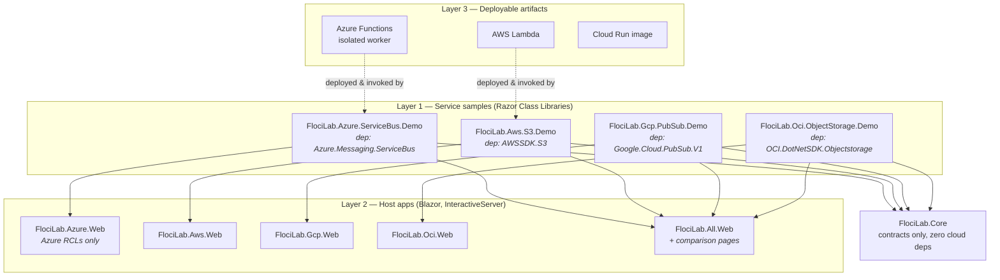

# FlociLab — Blazor + Aspire Multi-Cloud Sample Plan

A living plan and progress tracker for building **one .NET sample per Floci-emulated cloud service**,
composable into per-provider Blazor apps and a unified side-by-side comparison app, orchestrated by
Aspire.

**Status:** Phase 0–2 complete · Phase 3 under way · **46 / 183 services** (0 ⊘ — the last, Key Vault Keys,
cleared 2026-10-06 when floci-az 0.14.0 shipped this project's fix) · **5 / 5 comparison pages**
**Last updated:** 2026-10-06

---

## Contents

- [1. Goals and non-goals](#1-goals-and-non-goals)
- [2. Verified environment](#2-verified-environment)
- [3. Architecture](#3-architecture)
- [4. Project taxonomy](#4-project-taxonomy)
- [5. Repository layout](#5-repository-layout)
- [6. The Core contracts](#6-the-core-contracts)
- [7. Per-provider endpoint configuration](#7-per-provider-endpoint-configuration)
- [8. Side-by-side comparison app](#8-side-by-side-comparison-app)
- [9. Aspire orchestration](#9-aspire-orchestration)
- [10. Testing strategy](#10-testing-strategy)
- [11. Model selection and cost strategy](#11-model-selection-and-cost-strategy)
- [12. Phases](#12-phases)
- [13. Service checklists](#13-service-checklists)
- [14. Risk register](#14-risk-register)

---

## 1. Goals and non-goals

### Goals

1. **A working demo of every service Floci emulates** — 183 rows in §13, eventually. floci.io lists
   119 AWS, 28 Azure, 25 GCP and 8 OCI services (September 2026); §13 splits a few of those cards where
   the .NET SDK ships them as separate packages.
2. **Each service sample is independently consumable.** Someone who wants "Azure Service Bus in
   .NET" gets a project whose `.csproj` references exactly one cloud package. No AWS, no GCP, no
   unrelated noise. This is the unit that becomes a blog post or a YouTube video.
3. **Per-provider Blazor apps** — an Azure app with zero AWS/GCP references, and so on.
4. **One unified app with side-by-side comparison pages** — "here is object storage in four clouds,
   same operations, same screen."
5. **A live coverage matrix** — probe every service on startup and render what actually works from
   .NET today, including which ones return `501 NotImplemented`.
6. **Aspire orchestrates everything** — emulators, function hosts and web apps, one `F5`.

### Non-goals

- Reimplementing the Floci web console. It already covers AWS/Azure/GCP browsing well.
- Production-grade cloud abstraction. The comparison layer exists to *teach the differences*, not
  to hide them.
- Supporting real cloud endpoints. Emulator-only, by design.

### Why this is worth doing

floci's AWS compatibility suite covers Java (1,326 tests), Node (449), Python (311), Go (157) and the
AWS CLI (205). **.NET is not in it**, nor in floci-gcp's or floci-oci's. floci-az is the one
exception: its `sdk-test-dotnet` suite (in the repo since at least 2026-08-18) covers Service Bus,
Cosmos, Key Vault secrets and certificates, Blob SAS and SignalR — and nothing else, so Queue, Table,
Key Vault keys and the ARM plane are as untested from .NET as everything on the other three. The
series said ".NET is not in the matrix" without qualification until 2026-09-28. A `Testcontainers.Floci` package exists and Aspire
hosting is on the roadmap, but the .NET path is comparatively unexercised. Expect to find real
bugs — that discovery is part of the product, and it is the content angle nobody else has.

**OCI is the biggest differentiator:** verified against the shipped `floci-ui` binary, the console
supports `aws`, `azure` and `gcp` only — there is no OCI support at all. OCI samples here are not a
reimplementation of anything.

---

## 2. Verified environment

Everything below was checked against live registries and repos on 2026-08-28; the emulator rows were
re-checked on 2026-09-28, when the whole integration suite was re-run against them (§14 records what
changed).

| Component | Version | Notes |
| :--- | :--- | :--- |
| .NET SDK | `10.0.302` | Installed locally |
| Aspire | `13.5.3` | `Aspire.Hosting.AppHost`, `Aspire.AppHost.Sdk` |
| `Aspire.Hosting.Azure.Functions` | `13.5.3` | For Kind B Azure function projects |
| `Aspire.Hosting.AWS` | `13.7.2` | AWS-flavoured Aspire resources |
| `Testcontainers.Floci` | `4.14.0` | Official .NET Testcontainers module |
| `floci/floci` | `2.1.0` | 119 services; ships its own `HEALTHCHECK`. Samples through API Gateway REST were built on `1.7.0` |
| `floci/floci-az` | `0.14.0` | 28 services; health payload reports `version: dev`. Re-checked 2026-10-06 |
| `floci/floci-gcp` | `0.9.0` | 25 services |
| `floci/floci-oci` | `0.4.1` | 8 services |
| `floci/floci-ui` | `0.5.0` | Single combined server on `:4500`; **AWS/Azure/GCP only** |

Emulator endpoints (matching the Compose stack in the [README](../README.md)):

| Cloud | In-container | From host | Health path |
| :--- | :--- | :--- | :--- |
| AWS | `http://floci:4566` | `http://127.0.0.1:4566` | `/_floci/health` |
| Azure | `http://floci-az:4577` (+ AMQP `5672`/`5673`, Kafka `9093`) | `http://127.0.0.1:4577` | `/_floci/health` |
| GCP | `http://floci-gcp:4588` | `http://127.0.0.1:4588` | `/_floci-gcp/health` |
| OCI | `http://floci-oci:4599` | `http://127.0.0.1:4599` | `/_floci-oci/health` |

The health path is **not uniform** — `floci-gcp` and `floci-oci` namespace theirs and return `404`
on `/_floci/health`, so a probe that assumes one path reports two healthy emulators as unreachable.
Each image's own `HEALTHCHECK` is the authority. Related: `floci-az` answers `/_floci-az/health`
with a genuine `501`, which is a useful live example of the outcome the coverage matrix records.

---

## 3. Architecture

The central design tension: **isolated, single-dependency samples** vs. **a unified app that can
compare clouds side by side.** These are usually in conflict. Razor Class Libraries resolve them.



### Key decisions

| Decision | Choice | Rationale |
| :--- | :--- | :--- |
| Render mode | **Blazor Web App, global `InteractiveServer`** | Cloud SDK calls stay server-side. Under WebAssembly you would ship four cloud SDKs to the browser (tens of MB), do SigV4 signing client-side, and fight CORS against emulators that send no CORS headers. Server mode makes all of that a non-issue. |
| Sample unit | **Razor Class Library, one per service** | The RCL carries the page, the components and the client wrapper. Its `.csproj` references exactly one cloud SDK package. That is the blog/video artifact — clonable on its own. The single exception is a service the provider itself ships as more than one package, where one package alone cannot complete a round trip: see §14 and the OCI Secrets row in §13. A second package is never a convenience — it is a decision to take to the user, per constraint 1. |
| Host apps | **Five thin hosts** | Four per-provider + one unified. Each is ~50 lines of `Program.cs` plus nav, because all content lives in the RCLs. Cheap to maintain, and it satisfies "the Azure app has no AWS references". |
| Comparison | **Separate `FlociLab.Comparison` RCL** | Depends only on `FlociLab.Core` capability interfaces, never on provider SDKs. Referenced only by `FlociLab.All.Web`. |
| Cross-cloud coupling | **Capability interfaces in Core** | Provider RCLs opt in by implementing `IObjectStoreCapability` etc. Services with no analog (Textract, Bedrock) simply don't implement one and don't appear in comparison. |
| .NET version | **`net10.0`** | Matches the installed SDK. |

### Why RCLs specifically

A Razor Class Library compiles pages, components, CSS and static assets into a single package.
Static assets are served automatically from `_content/{AssemblyName}/`. So:

- `FlociLab.Azure.ServiceBus.Demo` alone → clone the folder, `dotnet run` a 20-line host, you have a
  Service Bus demo with one NuGet dependency. **That is the blog post.**
- The same RCL, referenced by `FlociLab.All.Web` → appears in the unified nav next to 182 others.

One implementation, two audiences, no duplication.

---

## 4. Project taxonomy

Not every service can be a Blazor page. Three kinds:

### Kind A — RCL demo (majority)

A Razor Class Library with a demo page and a thin client wrapper. Covers anything with a
request/response API surface: S3, SQS, DynamoDB, Blob, Cosmos, Key Vault, Pub/Sub, Firestore,
Object Storage, Vault, and so on.

```
samples/azure/servicebus/FlociLab.Azure.ServiceBus.Demo/
├── FlociLab.Azure.ServiceBus.Demo.csproj   # ONE official cloud package
├── ServiceBusDemo.cs                       # IServiceDemo implementation
├── ServiceBusClientFactory.cs              # endpoint wiring
├── Pages/ServiceBusPage.razor              # the UI
└── ServiceCollectionExtensions.cs          # AddServiceBusDemo()
```

### Kind B — deployable artifact + companion RCL

Serverless and container workloads can't be a Razor page — they are **separate deployable
projects** that get built, packaged and pushed *into* the emulator. Each pairs with a Kind A RCL
that deploys it, invokes it and renders the result.

| Cloud | Artifact project type | Emulator target |
| :--- | :--- | :--- |
| AWS | Lambda (`Amazon.Lambda.RuntimeSupport`), ECS/EKS container image | Lambda, ECS, EKS, Batch, CodeBuild |
| Azure | Isolated-worker Functions, ACI/AKS image | Functions, ACI, AKS, ACR |
| GCP | Cloud Run container, Cloud Functions source zip | Cloud Run, Cloud Functions, GKE |
| OCI | Fn Project function image | Functions, OKE |

```
functions/azure/FlociLab.Azure.Functions.OrderProcessor/   # Kind B artifact (a real function app)
samples/azure/functions/FlociLab.Azure.Functions.Demo/     # Kind A RCL that deploys + invokes it
```

> **Probe before building:** floci.io now lists Azure Functions with HTTP and Timer triggers, but its
> admin surface still answers `501 Only /admin/apps/... is supported` everywhere else (verified
> 2026-09-28). Find the route that actually deploys and invokes before writing the Kind B pair, and
> surface any `501` honestly via the coverage matrix rather than pretending.

### Kind C — infrastructure-only

No interactive workload; the page runs a scripted provisioning sequence and renders the resulting
resource tree. Covers CloudFormation, Cloud Control API, IAM, Organizations, VNet, Service Quotas,
Resource Groups Tagging, Service Usage.

---

## 5. Repository layout

```
floci/
├── README.md                       # the Docker/Portainer lab (done)
├── docs/BLAZOR-PLAN.md             # this file
├── docs/RCL-TEMPLATE.md            # file-by-file skeleton behind every Kind A sample
├── docs/WORKFLOW.md                # the /next -> /ship loop
├── FlociLab.slnx                   # slnx, the SDK's current default solution format
├── Directory.Build.props           # net10.0, nullable, warnaserror
├── Directory.Packages.props        # central package management — pins every SDK version
├── src/
│   ├── FlociLab.Core/              # contracts ONLY. zero cloud dependencies.
│   ├── FlociLab.Aws.Endpoints/     # endpoint wiring in SDK terms — AWSSDK.Core
│   ├── FlociLab.Azure.Endpoints/   #   ″   — Azure.Identity
│   ├── FlociLab.Gcp.Endpoints/     #   ″   — Google.Api.Gax.Grpc
│   ├── FlociLab.Oci.Endpoints/     #   ″   — OCI.DotNetSDK.Common
│   ├── FlociLab.Comparison/        # RCL: side-by-side pages, Core-only deps
│   └── FlociLab.AppHost/           # Aspire orchestration
├── hosts/
│   ├── FlociLab.Aws.Web/
│   ├── FlociLab.Azure.Web/
│   ├── FlociLab.Gcp.Web/
│   ├── FlociLab.Oci.Web/
│   └── FlociLab.All.Web/           # unified + comparison
├── samples/
│   ├── aws/{s3,sqs,dynamodb,...}/  # Kind A RCLs
│   ├── azure/{blob,servicebus,...}/
│   ├── gcp/{gcs,pubsub,...}/
│   └── oci/{objectstorage,vault,...}/
├── functions/                      # Kind B deployable artifacts
│   ├── aws/, azure/, gcp/, oci/
└── tests/
    └── FlociLab.IntegrationTests/  # Testcontainers.Floci
```

**The four `*.Endpoints` projects** exist because the wiring in §7 is expressed in SDK types —
`ClientConfig`, `TokenCredential`, `ClientBuilderBase<T>`, `IBasicAuthenticationDetailsProvider` —
and `FlociLab.Core` may never reference a cloud package. Each depends on exactly one *.Core-style
package that every sample for that provider already pulls in transitively, so a sample gains no
dependency it did not already have, and the endpoint story is written and fixed once per provider
rather than 119 times. Core keeps what needs no SDK: `FlociOptions` and the plain-value resolvers.

**Central Package Management** (`Directory.Packages.props`) is non-negotiable here. With ~180
projects each pulling a different cloud SDK, per-project version pinning becomes unmanageable
within a month.

---

## 6. The Core contracts

`FlociLab.Core` has **zero cloud dependencies**. This is what keeps samples isolated.

```csharp
namespace FlociLab.Core;

/// Every service sample implements this. One per emulated service.
public interface IServiceDemo
{
    /// "aws" | "azure" | "gcp" | "oci"
    string Provider { get; }
    /// Stable slug used in routes: "s3", "servicebus", "pubsub"
    string Slug { get; }
    string DisplayName { get; }
    /// "Storage" | "Messaging" | "Compute" | "Security" | ...
    string Category { get; }
    /// Route into the owning RCL page, e.g. "/azure/servicebus"
    string Route { get; }

    /// Cheapest possible list/describe call. Drives the coverage matrix.
    /// MUST distinguish NotImplemented (501) from Unreachable from Ok.
    Task<ProbeResult> ProbeAsync(CancellationToken ct);

    /// Scripted create -> read -> delete round-trip. Every step logged.
    IAsyncEnumerable<DemoStep> RunAsync(CancellationToken ct);
}

public enum ProbeStatus { Ok, NotImplemented, Unreachable, Error }

public sealed record ProbeResult(
    ProbeStatus Status,
    string? Detail = null,
    TimeSpan? Duration = null);

public sealed record DemoStep(
    string Title,
    string? Request  = null,   // raw HTTP / SDK call shown in the UI
    string? Response = null,
    bool Succeeded   = true,
    string? Error    = null);
```

Capability interfaces — implemented **only** where a genuine cross-cloud analog exists. These are
what the comparison pages consume:

```csharp
public interface IObjectStoreCapability   // S3 / Blob / GCS / OCI Object Storage
{
    Task<IReadOnlyList<ContainerInfo>> ListContainersAsync(CancellationToken ct);
    Task CreateContainerAsync(string name, CancellationToken ct);
    Task PutObjectAsync(string container, string key, Stream data, CancellationToken ct);
    Task<Stream> GetObjectAsync(string container, string key, CancellationToken ct);
    Task DeleteContainerAsync(string name, CancellationToken ct);
}

public interface IQueueCapability          // SQS / Azure Queue+Service Bus / Pub/Sub / OCI Queue
public interface ISecretStoreCapability    // Secrets Manager / Key Vault / Secret Manager / Vault
public interface IDocumentDbCapability     // DynamoDB / Cosmos / Firestore
public interface IKeyManagementCapability  // KMS / Key Vault keys / Cloud KMS / OCI KMS
```

An RCL's page is not routable just because the host references the project. In a Blazor Web App
the endpoint route table is built at startup by `MapRazorComponents<App>()`, and the `Router`
component does the routing that happens inside the interactive circuit — **both** have to be told
about the sample assembly, or the page 404s on a fresh request or dead-ends on an in-app link.
Hosts get the list from `IDemoCatalog.PageAssemblies` rather than naming assemblies by hand, so
routes arrive with the same single `Add*Demo()` call that registers the demo. Verified against
`FlociLab.Aws.S3.Demo`, 2026-08-29.

Registration is one line per sample, and hosts compose them:

```csharp
// FlociLab.Azure.Web/Program.cs — no AWS/GCP/OCI packages anywhere in this project
builder.Services
    .AddFlociCore()
    .AddAzureBlobDemo()
    .AddAzureServiceBusDemo()
    .AddAzureCosmosDbDemo();
```

---

## 7. Per-provider endpoint configuration

This is where most of the real effort lives. Difficulty is **not** uniform.

### AWS — easy

Every `Amazon*Config` exposes `ServiceURL`. One extension in `FlociLab.Aws.Endpoints` covers all
119 services.

```csharp
// FlociLab.Aws.Endpoints
public static TConfig ForFloci<TConfig>(this TConfig config, AwsEndpoints endpoints)
    where TConfig : ClientConfig
{
    config.ServiceURL = endpoints.ServiceUrl;            // http://floci:4566
    config.AuthenticationRegion = endpoints.Region;
    config.UseHttp = endpoints.UseHttp;
    return config;
}

// ...so a sample's client factory is two lines:
var config = new AmazonS3Config { ForcePathStyle = true }.ForFloci(endpoints);  // S3 only knob
return new AmazonS3Client(endpoints.Credentials(), config);                     // test/test
```

### OCI — easy to sign, and the one endpoint that fails *silently*

Signatures are **parsed but never verified**, so generate a throwaway RSA key at startup rather
than shipping one.

```csharp
ObjectStorageClient client = new(endpoints.AuthenticationProvider());  // FlociLab.Oci.Endpoints
client.ForFloci(endpoints);                                           //   ″
```

Needs a well-formed config profile (tenancy/user/fingerprint OCIDs), which
`AuthenticationProvider()` builds from the generated key — `Oci.Common.Auth.PrivateKeySupplier`
takes the PEM content directly, so nothing is written to disk. The image issues **no** tenancy OCID
of its own and sets no `FLOCI_OCI_DEFAULT_TENANCY_ID` unless you do, so the lab supplies a
synthetic one (`OciEmulatorOptions.DefaultTenancyId`) and the AppHost passes the same value to the
container. Buckets live in a **compartment**, and the tenancy OCID is the root compartment's, which
is why one value serves both.

> **`client.SetEndpoint(...)` is not enough, and this one bites hardest of the four.** Settled in
> Phase 1 against OCI.DotNetSDK 145.0.0. `RegionalClientBase`'s constructor requires a region on
> the credential — it `NullReference`s without one — and builds a *realm-specific endpoint
> template* from it. Every operation resolves its URI from that template, not from the endpoint.
> So `SetEndpoint` is ignored, `GetEndpoint()` goes on reporting the emulator address you set, and
> **the request goes to real Oracle Cloud**: a client configured for `http://127.0.0.1:1` spent
> 2.0 s reaching Ashburn and came back with a genuine 401 and an `iad-1:`-prefixed
> opc-request-id, while floci-oci's log stayed empty. `UseRealmSpecificEndpointTemplate(false)`
> does not help. `ForFloci` sets **both** the endpoint and the template, which is why samples call
> it rather than `SetEndpoint`. Pinned by `OciObjectStorageTests.SetEndpoint_Alone_Does_Not_Reach_The_Emulator`.

Another naming trap worth knowing before reading a sample: the SDK's operations have **no `Async`
suffix** — `client.GetNamespace(...)`, `client.PutObject(...)` — and return `Task<T>` anyway.
Nothing can be addressed at all until `GetNamespace` has told you the tenancy's Object Storage
namespace, which is looked up rather than configured.

### Azure — medium

No single knob; three distinct planes.

- **Storage (Blob/Queue/Table):** connection string with explicit per-service endpoints — and each
  service has its **own path**: Blob at `/devstoreaccount1`, Queue at `/devstoreaccount1-queue`, Table
  at `/devstoreaccount1-table`. A queue request on Blob's path reaches the Blob handler and answers
  501, which this repo misread for a month as Queue Storage being unimplemented (§14). Default
  account `devstoreaccount1` with the well-known Azurite key. **The endpoint host must be an IPv4
  literal**, which is why `AzureEndpoints.StorageRoot` rewrites it — Azure.Storage reads the
  account out of the URL path only for a literal address, and against a DNS name (`localhost`,
  `floci-az`) it assumes the production shape where the account is a subdomain and the first path
  segment is the container. The failure is quiet and misleading: `CreateContainer` returns 201,
  then the upload 404s with `ContainerNotFound`, because the SDK sent it to
  `/devstoreaccount1/hello.txt`. Verified on Azure.Storage.Blobs 12.29.2 (§14).
- **ARM plane (VM, VNet, AKS, ACR, Redis, ACI, Event Grid, Monitor):** `ArmClient` with
  `ArmClientOptions.Environment` pointed at the emulator.
- **Data plane (Key Vault, App Configuration, Cosmos, Service Bus, Event Hubs):** each takes a URI
  in its constructor.

**Credential:** don't hand-roll a fake `TokenCredential`. floci-az implements the **IMDS token
endpoint** and signs real v1.0 JWTs verifiable via JWKS — point `ManagedIdentityCredential` at it
via `FlociLab.Azure.Endpoints`:

```
AZURE_POD_IDENTITY_AUTHORITY_HOST=http://floci-az:4577
```

A **host**, not a URL. Azure.Identity appends `/metadata/identity/oauth2/token` itself; the
full-URL form was the older `AZURE_POD_IDENTITY_TOKEN_URL` variable and is silently ignored now.
Verified end to end on Azure.Identity 1.21.0 against floci-az: `GetTokenAsync` returns a real
signed JWT. The parameterless `ManagedIdentityCredential()` constructor is obsolete — pass
`new ManagedIdentityCredentialOptions()`.

**Messaging:** Service Bus and Event Hubs need `ServiceBusTransportType.AmqpTcp` and the AMQP
ports (`5673` / `5672`), not the HTTP port.

If an SDK refuses plain HTTP, enable TLS with `FLOCI_AZ_TLS_ENABLED=true` and fetch the generated
cert from `GET /_floci/tls-cert`.

### GCP — hardest, and the main technical risk

Three separate problems:

1. **Emulator detection works for some clients only.** Pub/Sub, Firestore and Datastore honour
   `EmulatorDetection.EmulatorOnly` plus `PUBSUB_EMULATOR_HOST` / `FIRESTORE_EMULATOR_HOST`.
2. **`Google.Cloud.Storage.V1` is REST/JSON — and it is the easy one.** Settled in Phase 1
   against 4.15.0; the warnings below were wrong on both counts.
   `StorageClientBuilder { BaseUri = "http://floci-gcp:4588/storage/v1/", UnauthenticatedAccess = true }`
   works, so there is no `HttpClient` fallback to budget for. `STORAGE_EMULATOR_HOST` is *not*
   ignored either: the builder carries an `EmulatorDetection` property, and `EmulatorOnly` plus
   that variable reaches the emulator on all three host spellings. Samples still take the `BaseUri`
   route — a web app that binds its endpoint from configuration should not depend on a
   process-wide environment variable — but both work, and `GcpStorageTests` pins each. Note this
   is the one Google service with no gRPC anywhere in its dependency tree, which is why it dodges
   problems 1 and 3 entirely; do not read its easiness as a forecast for Pub/Sub or Firestore.
3. **Everything is multiplexed on port 4588 via HTTP/2 ALPN.** gRPC clients need
   `ChannelCredentials.Insecure` and an explicit `GrpcAdapter`; some services route by
   `Host` header (`container.*` for GKE) or path prefix (`/container/v1`).
   **Settled for plain gRPC in Phase 2** against Pub/Sub (Google.Cloud.PubSub.V1 3.37.0, GAX
   4.15.0, floci-gcp 0.7.0): the three lines `ForFloci` sets are the whole story, and neither the
   multiplexing nor the ALPN handshake needed a workaround — see the retired row in §14. Take that
   as proof of the *transport* only. The `Host`-header and path-prefix routing above is still
   unproven, and the sample that first needs it should probe before writing code, not assume
   Pub/Sub's ease carries over — the same mistake item 2 warns about for Storage.

`FlociLab.Gcp.Endpoints` holds both routes, and they are mutually exclusive: `builder.ForFloci(…)`
sets endpoint + insecure credentials + adapter for an ordinary gRPC client, while an emulator-aware
client gets `UseEmulatorHost(…)` plus `EmulatorDetection.EmulatorOnly` and **no** explicit endpoint.

Phase 1 exists specifically to hit all four of these problems in week one.

### Configuration binding

One options class, bound from `appsettings.Development.json`, overridable by environment so the
same build runs on the host or inside the Compose network:

```json
{
  "Floci": {
    "Aws":   { "Endpoint": "http://127.0.0.1:4566", "Region": "us-east-1" },
    "Azure": { "Endpoint": "http://127.0.0.1:4577", "AccountName": "devstoreaccount1" },
    "Gcp":   { "Endpoint": "http://127.0.0.1:4588", "ProjectId": "floci-local" },
    "Oci":   { "Endpoint": "http://127.0.0.1:4599" }
  }
}
```

### 7.9 Targeting real cloud

Every sample can run against the real provider as well as the emulator. `UseEmulator` on each
provider's options defaults to **`true`**, so nothing bills by accident and the app still starts
with no configuration; setting it to `false` makes the factory build the client the production way.

This exists because the series' headline claim — *this is ordinary SDK code you could ship* — was
not actually checkable before, and was overstated in three scripts. The emulator knobs were
unconditional, and two of them are **wrong** against real cloud rather than merely redundant:

| Provider | Emulator-only configuration | Why real cloud cannot just reuse it |
| :--- | :--- | :--- |
| AWS | `ServiceURL` · `ForcePathStyle = true` · `MaxErrorRetry = 0` · static `test`/`test` credentials | Real S3 addresses new buckets as a subdomain; forcing path style is deprecated, not merely unnecessary. The static credentials are rejected. |
| Azure | emulator connection string · `MaxRetries = 0` · the `StorageRoot` IPv4 rewrite | The rewrite exists only for the emulator's path-style account, and the well-known Azurite key is not a real credential. |
| GCP | `BaseUri` · `UnauthenticatedAccess = true` | `UnauthenticatedAccess` stops the client looking for the credentials it now genuinely needs. |

So the branch is a real fork, not the same call with the endpoint blanked out. What is identical
either way is everything downstream — the demo, the capability, the page. That is the claim, and it
is now demonstrable rather than asserted.

**Credentials.** AWS and GCP fall back to their own ambient chains (profile/SSO/IMDS, and ADC).
Azure storage is the exception: it authenticates with an account key rather than a `TokenCredential`,
so real-cloud mode needs `Floci:Azure:ConnectionString` supplied. Reaching for
`DefaultAzureCredential` would mean adding `Azure.Identity` and breaking constraint 1, which is not
a trade worth making. It throws at construction if the flag is false and no connection string is
configured, rather than quietly addressing `devstoreaccount1` against a real endpoint.

> **Never put a real connection string in `appsettings*.json`.** User secrets or an environment
> variable only. `appsettings.RealCloud.json` is committed and deliberately contains no secret.

**Running both at once.** The `realcloud` launch profile runs the same binary on `:5116` under the
`RealCloud` environment, so the emulator instance on `:5115` and the real-cloud one can sit side by
side on screen. Each page's fact list leads with a **Target** row — muted for the emulator, red for
real cloud — which is the one fact that has to be readable off a paused frame, and the one a
presenter needs to notice before clicking Run on an account that bills.

**Testing.** CI stays emulator-only and needs no secrets: nothing in the suite sets the flag.
`TargetSelectionTests` pins the safe default in both the options and the three factories, plus the
Azure throw. Real-cloud verification is a manual run per episode, recorded in that episode's claims
table in `../floci-content` with a date — the same table that already carries every other claim.

---

## 8. Side-by-side comparison app

`FlociLab.Comparison` is an RCL referenced only by `FlociLab.All.Web`. It depends on
`FlociLab.Core` and **nothing else** — it discovers providers through DI.

```csharp
@inject IEnumerable<IObjectStoreCapability> Stores
// renders one column per registered provider, N columns wide
```

Two things the object-storage page settled for the four that follow it:

- **A host declares the RCL's routes with `AddComparisonPages()`.** The RCL registers no
  `IServiceDemo`, so nothing else can tell the catalog it owns pages — see §14's retired
  `SampleAssemblies()` row for the failure this avoids.
- **The page cannot classify an SDK exception, so it asks the capability to.**
  `ICloudCapability.Classify(Exception)` returns a `ProbeStatus`, and every implementation
  delegates to the same classifier its demo's probe uses. Without it a documented `501` would
  render identically to a genuine break, and `/coverage` and the comparison page could disagree
  about the same operation.

Planned comparison pages:

| Page | Capability | Providers |
| :--- | :--- | :--- |
| Object storage | `IObjectStoreCapability` | S3 · Blob · GCS · OCI Object Storage |
| Queues | `IQueueCapability` | SQS · Queue Storage + Service Bus · Pub/Sub · OCI Queue |
| Secrets | `ISecretStoreCapability` | Secrets Manager · Key Vault · Secret Manager · OCI Vault |
| Document DB | `IDocumentDbCapability` | DynamoDB · Cosmos NoSQL · Firestore | *(no OCI analog)* |
| Key management | `IKeyManagementCapability` | KMS · Key Vault keys · Cloud KMS · OCI KMS |

Each page runs **the same logical operation** across every provider simultaneously and shows, per
column: the .NET code, the raw wire request, the response, and elapsed time. That last part —
identical operation, four SDKs, four wire formats, one screen — is the thing that doesn't exist
anywhere else and is the strongest content hook.

**Coverage matrix page** (`/coverage`) is the other unified-app-only feature: calls `ProbeAsync`
on every registered demo in parallel and renders a live grid of Ok / NotImplemented / Unreachable. It is
useful from day one, before a single demo is written, and it is how the checklists in section 13
stay honest.

---

## 9. Aspire orchestration

`Aspire.Hosting.Floci` does not exist yet ([upstream issue #1242](https://github.com/floci-io/floci/issues/1242)),
so write a small extension over `AddContainer`. The emulator images ship their own `HEALTHCHECK`,
so Aspire's readiness gating works without extra configuration.

```csharp
var builder = DistributedApplication.CreateBuilder(args);

EnsureNetwork("floci");   // see "Sibling containers" below

var aws = builder.AddContainer("floci", "floci/floci", "latest")
    .WithHttpEndpoint(port: 4566, targetPort: 4566, name: "http")
    .WithEnvironment("FLOCI_HOSTNAME", "floci")
    .WithEnvironment("FLOCI_STORAGE_MODE", "persistent")
    .WithEnvironment("FLOCI_SERVICES_LAMBDA_DOCKER_NETWORK", "floci")
    .WithContainerNetworkAlias("localhost.floci.io")
    .WithDockerSocket()                                  // -v, not WithBindMount — see below
    .WithSharedNetwork("floci", "floci", "localhost.floci.io")
    .WithHttpHealthCheck("/_floci/health", endpointName: "http")
    .WithLifetime(ContainerLifetime.Persistent);

// ... floci-az, floci-gcp, floci-oci the same way, with their own health paths ...

builder.AddProject<Projects.FlociLab_All_Web>("all")
       // Bound by FlociOptions rather than service discovery, so the same build runs on the host
       // and inside the Compose network.
       .WithEnvironment("Floci__Aws__Endpoint", aws.GetEndpoint("http"))
       .WithEnvironment("AZURE_POD_IDENTITY_AUTHORITY_HOST", az.GetEndpoint("http"))
       .WaitFor(aws).WaitFor(az).WaitFor(gcp).WaitFor(oci);

builder.Build().Run();
```

`floci-ui` joins the same AppHost, so `dotnet run` also brings up the web console on `:4500`. It
is a *client* of three emulators rather than one itself: it reaches them by container name over the
app network, waits on their health checks, and has no OCI support, which is why `floci-oci` is not
among its `WaitFor`s. It is also the one image with no `HEALTHCHECK` of its own, so Aspire polls
`/` for it.

**The Docker socket is a runtime arg, not a bind mount.** `/var/run/docker.sock` is not a host
filesystem path on Windows; `WithBindMount` makes its source absolute against the AppHost folder
and produces a nonsense path. `WithContainerRuntimeArgs("-v", "/var/run/docker.sock:…")` hands it
to the daemon untouched.

**Sibling containers need a network whose name can be written down.** Emulator-to-emulator DNS is
free — Aspire aliases every container by resource name, so `http://floci-az:4577` resolves from
inside `floci` (verified). But Lambda, Functions, Cloud Run and Fn containers are started *by the
emulators* and land on the network named in `FLOCI_SERVICES_LAMBDA_DOCKER_NETWORK`, which has to be
known before the emulator starts. Aspire's own network is
`aspire-persistent-network-<hash>-<apphost>`, generated per machine. So the AppHost creates a
second network called `floci` — the same name the README's Compose stack uses — and joins every
emulator to it with `--network name=floci,alias=<resource>`; without the alias the container is
only known there by its generated name. Verified from a throwaway container on that network: all
four emulators, plus `localhost.floci.io`, resolve.

What Aspire buys beyond convenience:

- **OpenTelemetry traces of every SDK call** in the dashboard. When a GCP gRPC call fails against
  port 4588, the trace shows the actual request. This is worth more than any individual demo page.
- **`WaitFor` on real health checks**, so no start-order races.
- **One `F5`** launches four emulators, five web apps and the function hosts.
- Later: `Aspire.Hosting.Azure.Functions` (13.5.3) hosts the Kind B Azure function projects, and
  `Aspire.Hosting.AWS` (13.7.2) does the same for Lambda.

---

## 10. Testing strategy

Every sample ships one integration test using `Testcontainers.Floci` (4.14.0) — a throwaway
emulator per test class, so CI needs no running stack.

```csharp
[Fact]
public async Task ServiceBus_RoundTrip_Succeeds()
{
    await using var floci = new FlociAzBuilder().Build();
    await floci.StartAsync();
    var demo = new ServiceBusDemo(floci.GetEndpoint());

    var steps = await demo.RunAsync(default).ToListAsync();

    Assert.All(steps, s => Assert.True(s.Succeeded, s.Error));
}
```

`Testcontainers.Floci` 4.14.0 defaults to `floci/floci:1.5.13` and has deprecated its
parameterless `FlociBuilder()` constructor, so pass the image explicitly:
`new FlociBuilder("floci/floci:latest")`. A suite that tests an older build than the AppHost runs
is not the tripwire the checklists need it to be. There is no Testcontainers module for `floci-az`,
`floci-gcp` or `floci-oci` — those three need a plain `ContainerBuilder`, which Phase 1 will settle.

Rules:

- A demo is **not** checked off in section 13 until its integration test passes.
- Probe tests are allowed to assert `NotImplemented` — that is a legitimate, documented outcome
  (Azure Functions today). Assert the *expected* status, so the test fails loudly when upstream
  starts implementing it. That is how the coverage matrix stays truthful.
- Kind B artifacts get a build-and-deploy test, not just an invoke test.

---

## 11. Model selection and cost strategy

You review with Opus before merge, so the goal is to get each PR to *reviewable* quality as
cheaply as possible.

| Work | Model | Why |
| :--- | :--- | :--- |
| **Phase 0**: Core contracts, capability interfaces, the four endpoint factories, Aspire AppHost, the first RCL template | **Opus 5** | One-time, high-leverage, expensive to unwind. The GCP transport problem and the Azure three-plane credential story are genuine design work. Everything downstream copies these decisions — get them right once. |
| **Phases 2–4**: each service demo once the template exists | **Sonnet 5** | Pattern-following against a fixed template and a documented SDK. This is ~90% of total volume, so it dominates cost. Sonnet is the right default here. |
| **Scaffolding**: `.csproj` files, folder skeletons, DI registration lines, nav entries, checklist updates, table regeneration | **Haiku 4.5** | Mechanical and compiler-verified. Cheapest thing that works. |
| **Escalation**: a service where Sonnet stalls twice — usually a GCP transport or Azure ARM shape problem | **Opus 5** | Escalate on stall, not preemptively. |
| **Pre-merge review** | **Opus 5** via `/code-review` | Your existing workflow. |

### Practical cost rules

1. **Batch 3–5 services per session, then start a fresh one.** Context is the dominant cost driver
   and it grows superlinearly across a long session. This plan file exists so a fresh cheap session
   can resume with no re-derivation.
2. **Never start a service in Opus.** Start in Sonnet; escalate only after two genuine failed
   attempts. Most services are ~150 lines against a documented API.
3. **Front-load the hard ones in Phase 1 while you're in Opus anyway.** GCS, Service Bus AMQP and
   OCI signing are the three that will teach you the most per token.
4. **Let the compiler and the integration test do the verification**, not another model pass.
5. **Don't spawn subagents for this work.** Each one starts cold and re-derives context you already
   have. The `/next` and `/ship` skills are designed for inline execution.

### Rough allocation

| Phase | Volume | Model mix |
| :--- | :--- | :--- |
| 0 — spine | ~10 files | Opus 90% / Haiku 10% |
| 1 — first slice (4 services) | ~20 files | Opus 60% / Sonnet 40% |
| 2 — big five (20 services) | ~80 files | Sonnet 80% / Haiku 15% / Opus 5% |
| 3 — bulk fill (~100 services) | ~400 files | Sonnet 75% / Haiku 20% / Opus 5% |
| 4 — container-backed | ~30 files | Sonnet 60% / Opus 40% |

---

## 12. Phases

### Phase 0 — The spine ☑

No service demos at all. Ship the skeleton.

- [x] `FlociLab.slnx`, `Directory.Build.props`, `Directory.Packages.props`
- [x] `FlociLab.Core` — `IServiceDemo`, `ProbeResult`, `DemoStep`, 5 capability interfaces
- [x] `FlociLab.AppHost` — Aspire, 4 emulator containers with `WaitFor`
- [x] `FlociLab.All.Web` — Blazor Web App, global `InteractiveServer`
- [x] `/coverage` page — probes everything registered, renders the live matrix
- [x] The four endpoint factories (AWS, Azure, GCP, OCI) with config binding
- [x] `dotnet run` on AppHost brings up 4 emulators + 1 web app, all green

**Exit criteria:** the coverage page loads and shows four reachable emulators with zero demos
registered. **Met 2026-08-29** — all four report `Ok` in ~2.2 s against floci 1.7.0, floci-az,
floci-gcp 0.7.0 and floci-oci 0.3.0, with the demo table showing "No demos registered".

### Phase 1 — One vertical slice, all four clouds ☑

Object storage only. **Deliberately front-loads every hard endpoint problem at once.**

- [x] `FlociLab.Aws.S3.Demo` (RCL + `IObjectStoreCapability` + test)
- [x] `FlociLab.Azure.Blob.Demo`
- [x] `FlociLab.Gcp.Storage.Demo` ← was billed **the risky one**; it was the easiest of the three
- [x] `FlociLab.Oci.ObjectStorage.Demo`
- [x] `FlociLab.Comparison` + the object-storage comparison page
- [x] The four per-provider host apps
- [x] The RCL template + this skill, both proven by four real uses

**Exit criteria:** one page shows the same upload/list/download across four clouds, and you know
exactly how hard GCS and OCI are going to be. **Met 2026-08-30** — `/comparison/object-storage`
renders all four columns, and the hard parts are recorded: GCP was the easiest of the three, OCI's
`SetEndpoint` silently reaches real Oracle Cloud, and Azure needs an IPv4 literal for path-style.

### Phase 2 — The big five per provider ☑

The ~20 services that cover most of what anyone actually tries: storage (done in Phase 1), queue,
document DB, secrets, key management. Each gets a capability implementation, so all five comparison
pages light up.

- [x] Queues — SQS · Queue Storage + Service Bus · Pub/Sub · OCI Queue
- [x] Document DB — DynamoDB · Cosmos DB NoSQL · Firestore — **no OCI analog, by design** (§8)
- [x] Secrets — Secrets Manager · Key Vault Secrets · Secret Manager · OCI Vault Secrets
- [x] Key management — KMS · Key Vault Keys · Cloud KMS · OCI Vault + KMS
- [x] All five comparison pages render (§13)

**Exit criteria:** every provider that has an analog implements all five capability interfaces, and
all five comparison pages render. **Met 2026-09-04** — 20 services across the five capabilities,
finishing with `/comparison/key-management`. Three of the twenty were ⊘ at the time: floci-az
implemented neither Queue Storage nor any `/keys` route, and its Key Vault `/secrets` route was
broken in two separate ways (§14). Their samples, pages and tests still shipped, which is what let
those comparison columns render an honest red rather than a gap. **Updated 2026-09-28:** floci-az
0.13.0 fixed both Key Vault Secrets gaps — see §14 and the Key Vault Secrets row in §13, now ☑.
Queue Storage was never an emulator gap: the queue endpoint pointed at Blob's path, and with the
`-queue` suffix floci-az serves it end to end (§14, now ☑). **Updated 2026-10-06:** Key Vault Keys,
the last ⊘, is ☑. This project filed floci-az #348 and opened PR #349, merged and released in 0.14.0
(§14).

### Phase 3 — Bulk fill ◐

The remaining ~100 Kind A and Kind C services, one PR per category, using the skill. This is where
the cost strategy matters most.

**Started 2026-09-04.** Everything ticked after the five comparison pages belongs here, not to a
Phase 2 leftover: AWS IAM, SSM, EventBridge and EventBridge Pipes. There is no per-item checklist
in this section because §13 *is* the checklist — **`/next` picks the first ☐ row there**, working
down a provider's tables in order. Rows already resolved as ⊘ are done, not pending, and Kind B
rows belong to Phase 4; skip both.

### Phase 4 — Container-backed services ☐

Lambda, RDS, ECS, EKS, MWAA, Cloud Run, GKE, AKS, ACI, OCI Functions, OKE. They need the Docker
socket, they are slow, and they are the flakiest. Feature-flag them off by default so the rest of
the app stays fast.

---

## 13. Service checklists

Legend: ☐ not started · ◐ in progress · ☑ demo + test passing · ⊘ emulator returns 501

Per service: **RCL** (page + wrapper) · **T** (integration test) · **C** (capability, where an
analog exists).

### AWS — `floci` :4566 — 31/119

Rows follow the service cards on [floci.io/aws](https://floci.io/aws/), split only where the .NET
SDK splits the package (constraint 1): EventBridge/Pipes/Scheduler, SES v1/v2, Bedrock/Runtime,
AppConfig/AppConfigData and CUR/BCM Data Exports are one card each there and two or three rows
here. DynamoDB Streams stays in the DynamoDB row — same package. Kind B marks every service floci.io flags as
running a real engine in Docker, which is what makes it Phase 4. Re-synced against floci 2.1.0,
2026-09-28.

<details open>
<summary><strong>Core app services (8/9)</strong></summary>

| ☐ | Service | Kind | Capability |
|:-:|:---|:---|:---|
| ☑ | S3 | A | `IObjectStore` |
| ☑ | SQS | A | `IQueue` |
| ☑ | SNS | A | — |
| ☑ | DynamoDB | A | `IDocumentDb` |
| ☐ | Lambda | B | — |
| ☑ | IAM | C | — |
| ☑ | KMS | A | `IKeyManagement` |
| ☑ | Secrets Manager | A | `ISecretStore` |
| ☑ | SSM | A | — |
</details>

<details>
<summary><strong>Events and workflows (7/7)</strong></summary>

| ☐ | Service | Kind |
|:-:|:---|:---|
| ☑ | EventBridge | A |
| ☑ | EventBridge Pipes | A |
| ☑ | EventBridge Scheduler | A |
| ☑ | Step Functions | A |
| ☑ | SWF | A |
| ☑ | CloudWatch Logs | A |
| ☑ | CloudWatch Metrics | A |
</details>

<details>
<summary><strong>API, networking and edge (10/10)</strong></summary>

| ☐ | Service | Kind |
|:-:|:---|:---|
| ☑ | API Gateway REST | A |
| ☑ | API Gateway v2 (HTTP + WebSocket) | A |
| ☑ | AppSync | A |
| ☑ | Route 53 | A |
| ☑ | Route 53 Resolver | C |
| ☑ | CloudFront | C |
| ☑ | Cloud Map | A |
| ☑ | ELB v2 | C |
| ☑ | ELB Classic | C |
| ☑ | Global Accelerator | C |
</details>

<details>
<summary><strong>Identity and access (5/9)</strong></summary>

| ☐ | Service | Kind |
|:-:|:---|:---|
| ☑ | STS | A |
| ☑ | Cognito | A |
| ☑ | IAM Identity Center | C |
| ☑ | IAM Access Analyzer | C |
| ☑ | Organizations | C |
| ☑ | Resource Access Manager | C |
| ☐ | AWS Account | C |
| ☐ | Verified Permissions | A |
| ☐ | ACM | A |
</details>

<details>
<summary><strong>Containers and compute (0/10)</strong></summary>

| ☐ | Service | Kind |
|:-:|:---|:---|
| ☐ | ECS | B |
| ☐ | EC2 | B |
| ☐ | Lightsail | A |
| ☐ | EKS | B |
| ☐ | ECR | B |
| ☐ | AWS Batch | B |
| ☐ | Lambda MicroVMs | B |
| ☐ | Auto Scaling | C |
| ☐ | Application Auto Scaling | C |
| ☐ | Elastic Beanstalk | C |
</details>

<details>
<summary><strong>Developer tools and delivery (0/8)</strong></summary>

| ☐ | Service | Kind |
|:-:|:---|:---|
| ☐ | CodeBuild | B |
| ☐ | CodeDeploy | B |
| ☐ | CodePipeline | B |
| ☐ | CodeGuru Reviewer | A |
| ☐ | CloudFormation | C |
| ☐ | Cloud Control API | C |
| ☐ | AppConfig | A |
| ☐ | AppConfigData | A |
</details>

<details>
<summary><strong>Storage, transfer and backup (0/6)</strong></summary>

| ☐ | Service | Kind |
|:-:|:---|:---|
| ☐ | S3 Tables | A |
| ☐ | S3 Vectors | A |
| ☐ | EFS | C |
| ☐ | DataSync | C |
| ☐ | Transfer Family | A |
| ☐ | AWS Backup | C |
</details>

<details>
<summary><strong>Databases and caching (0/8)</strong></summary>

| ☐ | Service | Kind |
|:-:|:---|:---|
| ☐ | RDS | B |
| ☐ | RDS Data API | B |
| ☐ | Neptune | B |
| ☐ | DocumentDB | B |
| ☐ | MemoryDB | B |
| ☐ | ElastiCache | B |
| ☐ | Redshift | B |
| ☐ | Redshift Data API | B |
</details>

<details>
<summary><strong>Messaging and streaming (0/9)</strong></summary>

| ☐ | Service | Kind |
|:-:|:---|:---|
| ☐ | SES (v1) | A |
| ☐ | SES v2 | A |
| ☐ | Kinesis | A |
| ☐ | Data Firehose | A |
| ☐ | MSK | B |
| ☐ | Amazon MQ | B |
| ☐ | IoT Core | A |
| ☐ | Amazon Connect | A |
| ☐ | AppIntegrations | A |
</details>

<details>
<summary><strong>Analytics (0/8)</strong></summary>

| ☐ | Service | Kind |
|:-:|:---|:---|
| ☐ | Athena | B |
| ☐ | Glue | A |
| ☐ | EMR | C |
| ☐ | EMR Serverless | C |
| ☐ | Managed Service for Apache Flink | B |
| ☐ | OpenSearch | B |
| ☐ | Lake Formation | C |
| ☐ | MWAA (Airflow) | B |
</details>

<details>
<summary><strong>AI and ML (0/8)</strong></summary>

| ☐ | Service | Kind |
|:-:|:---|:---|
| ☐ | Bedrock | A |
| ☐ | Bedrock Runtime | A |
| ☐ | Bedrock AgentCore | A |
| ☐ | Textract | A |
| ☐ | Transcribe | A |
| ☐ | Comprehend | A |
| ☐ | Rekognition | A |
| ☐ | Translate | A |
</details>

<details>
<summary><strong>Security and compliance (0/10)</strong></summary>

| ☐ | Service | Kind |
|:-:|:---|:---|
| ☐ | WAF v2 | C |
| ☐ | Network Firewall | C |
| ☐ | GuardDuty | C |
| ☐ | Security Hub | C |
| ☐ | Detective | C |
| ☐ | Inspector | C |
| ☐ | Macie | C |
| ☐ | CloudHSM v2 | C |
| ☐ | CloudTrail | A |
| ☐ | AWS Config | C |
</details>

<details>
<summary><strong>Monitoring and observability (0/3)</strong></summary>

| ☐ | Service | Kind |
|:-:|:---|:---|
| ☐ | CloudWatch RUM | A |
| ☐ | Managed Prometheus | A |
| ☐ | CloudWatch OAM | C |
</details>

<details>
<summary><strong>Governance and management (0/7)</strong></summary>

| ☐ | Service | Kind |
|:-:|:---|:---|
| ☐ | Resource Groups Tagging API | C |
| ☐ | Resource Explorer 2 | C |
| ☐ | Service Catalog | C |
| ☐ | Service Quotas | C |
| ☐ | Control Tower | C |
| ☐ | Control Catalog | C |
| ☐ | AWS FIS | C |
</details>

<details>
<summary><strong>Cost and billing (0/7)</strong></summary>

| ☐ | Service | Kind |
|:-:|:---|:---|
| ☐ | Pricing | A |
| ☐ | Cost Explorer | A |
| ☐ | AWS Budgets | A |
| ☐ | BCM Pricing Calculator | A |
| ☐ | Cost and Usage Reports | B |
| ☐ | BCM Data Exports | B |
| ☐ | AWS Marketplace | A |
</details>

### Azure — `floci-az` :4577 — 6/31

[floci.io/az](https://floci.io/az/) lists 28 services. Three more rows here: Key Vault is one card
but three packages (Secrets, Keys, Certificates), and Cosmos DB's non-NoSQL APIs each need their own
driver. Re-synced against floci-az 0.13.0, 2026-09-28.

| ☐ | Service | Kind | Capability | Notes |
|:-:|:---|:---|:---|:---|
| ☑ | Blob Storage | A | `IObjectStore` | connection string, **IPv4-literal host** (§7). `GetAccountInfo`, container metadata/ACL and server-side copy ⊘ 501; snapshot works since floci-az 0.13.0 (501 on 0.11.0). `DeleteIfExists` on a container that never existed answers 202/true where real Azure answers 404/false |
| ☑ | Queue Storage | A | `IQueue` | Served under **`/{account}-queue`**, not the bare account path. Recorded ⊘ from 2026-08-31 to 2026-09-28 as "floci-az does not implement Queue Storage" — a misdiagnosis: this repo's connection string pointed the queue endpoint at Blob's path, so `CreateQueue` reached the Blob handler (501) and `ListQueues` got a Blob container listing back (§14). The suffix was in floci-az's README throughout. Fixed in `AzureEndpoints.StorageConnectionString`; the round trip is green and `AzureQueueTests` pins the wrong address as well as the right one |
| ☐ | Table Storage | A | — | Served under `/{account}-table` (already in `StorageConnectionString`) — probed 2026-09-28: `POST /devstoreaccount1-table/Tables` → 201 and the table lists. OData filters, batch |
| ☑ | Cosmos DB (NoSQL) | A | `IDocumentDb` | always-on, no Docker. Account served at a **`-cosmos` suffixed path** off the Blob/Queue port; signature not verified (a garbage `Authorization` header still answers 200). `Gateway` mode + `LimitToEndpoint` are both required (§14). Needs an explicit `Newtonsoft.Json` reference or the SDK's own targets hard-error |
| ☐ | Cosmos DB — MongoDB / Cassandra / Gremlin / PostgreSQL APIs | B | — | Docker-backed engines (MongoDB Community, ScyllaDB, TinkerPop, Citus), each reached through a different driver — likely several samples, and each driver has to count as the official SDK for constraint 1. Settle that before building |
| ☐ | Azure SQL Database | B | — | ARM + SQL Server container |
| ☐ | PostgreSQL Flexible Server | B | — | ARM + `postgres` container |
| ☐ | MySQL Flexible Server | B | — | ARM + MySQL container — new since the plan was written |
| ☐ | MariaDB Server | B | — | ARM + MariaDB container — new since the plan was written |
| ☐ | Azure Cache for Redis | B | — | ARM + optional Redis container |
| ☐ | Azure Functions | B | — | floci.io lists HTTP/Timer triggers. The admin surface answers 501 `Only /admin/apps/... is supported` outside `/admin/apps/`, verified 2026-09-28 — probe the real route before building |
| ☐ | Virtual Machines | C | — | ARM; Docker optional |
| ☐ | Azure Kubernetes Service | B | — | real k3s or mock |
| ☐ | Container Registry | B | — | ARM + shared `registry:2` |
| ☐ | Container Instances | C | — | ARM; Docker optional |
| ☐ | Container Apps | B | — | ARM + ingress proxy — new since the plan was written |
| ☐ | API Management | C | — | gateway + policy subset, `/{account}-apim/` |
| ☐ | Virtual Network | C | — | |
| ☐ | Event Hubs | A | — | **AMQP :5672** / Kafka :9093; partitions emulated since 0.13.0 |
| ☑ | Service Bus | A | `IQueue` | Two planes, two clients from one package: `ServiceBusAdministrationClient` (entity CRUD, plain HTTP on the port Blob/Queue/Cosmos share) and `ServiceBusClient` (**AMQP 1.0 :5673**, an Artemis sidecar floci-az launches through the Docker socket). Emulator mode cannot use `Credential()` the way Key Vault does — both client types only drop TLS and honour a custom host:port when built from a `UseDevelopmentEmulator=true` connection string. Needs `FLOCI_AZ_SERVICES_SERVICE_BUS_MOCKED=false`, and the AppHost must **not** publish 5673 itself: the sidecar binds that host port directly, so publishing it too makes the sidecar's own bind fail (§14). `DeleteQueue` was ⊘ 501 through floci-az 0.12.0 (a bare queue-name DELETE was routed to the Blob handler); **routed since 0.13.0**, found 2026-09-28 when the tripwire test failed — the round trip is now green end to end (§14) floci-az 0.13.0 reported `DeliveryCount: 2` on a first delivery where real Service Bus reports 1. 0.14.0 fixed it (floci-az #314, "restore zero-based AMQP delivery counts"), and `AzureServiceBusTests` now pins `DeliveryCount: 1`, confirmed 2026-10-06 |
| ☐ | Communication Services Email | A | — | inspection mailbox |
| ☐ | Event Grid | A | — | webhook delivery + retry, CloudEvents |
| ☐ | SignalR | A | — | ASP.NET Core hubs in Default mode — new since the plan was written |
| ☐ | Microsoft Entra ID | C | — | OAuth2 / OIDC, JWKS-verifiable JWTs |
| ☐ | Managed Identity | C | — | **IMDS token endpoint** — already what every Key Vault sample authenticates through |
| ☐ | Microsoft Graph | C | — | narrow `/v1.0` slice: service principals, group membership |
| ☑ | Key Vault Secrets | A | `ISecretStore` | Split from Keys because `Azure.Security.KeyVault.Secrets`/`.Keys` are separate packages (constraint 1). The SDK refuses bearer tokens over floci-az's plain HTTP with no override — worked around in `FlociAzureExtensions.AllowInsecureBearerToken` (§14). Was ⊘ through floci-az 0.12.0 (`ListSecrets` misrouted, `attributes.nbf`/`exp` sent as JSON `null`) — **both fixed in 0.13.0**, confirmed 2026-09-28 by the sample's own integration tests, which were written as the tripwire for this (§14). Demo, page and tests now assert the real round trip, including that the purge leaves nothing in the deleted-secrets list |
| ☑ | Key Vault Keys | A | `IKeyManagement` | Was ⊘ from 2026-09-01 to 2026-10-06. Through floci-az 0.12.0 every `/keys` route 404'd. 0.13.0 routed them but misrouted the SDK's trailing-slash `GET keys/` and sent `attributes.nbf`/`exp` as JSON `null`. **floci-az 0.14.0 fixed both, via floci-az PR #349 from this project** (issue #348, §14). With create working, a third behaviour surfaced: every key id comes back on `https://{account}.vault.azure.net/keys/…` (hardcoded in floci-az, not echoed from the request), so `KeyVaultKeysClientFactory.CreateCryptographyClient` re-addresses the id's path at the emulator in emulator mode (§14). Round trip, re-runs and capability green, 2026-10-06 |
| ☐ | Key Vault Certificates | A | — | `Azure.Security.KeyVault.Certificates`, a third package (constraint 1). Self-signed lifecycle since 0.13.0; needs the same insecure-bearer workaround as its two siblings (§14) |
| ☐ | Monitor / Log Analytics | A | — | KQL subset |
| ☐ | App Configuration | A | — | labels, feature flags; `/{account}-appconfig`, and the SDK insists on HTTPS |

### GCP — `floci-gcp` :4588 — 5/25

One row per card on [floci.io/gcp](https://floci.io/gcp/). Re-synced against floci-gcp 0.9.0,
2026-09-28.

| ☐ | Service | Kind | Capability | Transport |
|:-:|:---|:---|:---|:---|
| ☑ | Cloud Storage (GCS) | A | `IObjectStore` | REST — no gRPC, risk retired, see §7. floci-gcp 0.8.0 added a gRPC v2 surface the REST SDK does not use; 0.9.0 enforces the non-empty-bucket 409 and bucket-name validation (§14) |
| ☑ | Pub/Sub | A | `IQueue` | gRPC + REST — first gRPC service, risk retired, see §14 |
| ☑ | Firestore | A | `IDocumentDb` | gRPC |
| ☐ | Datastore | A | — | HTTP/protobuf |
| ☑ | Secret Manager | A | `ISecretStore` | gRPC |
| ☑ | Cloud KMS | A | `IKeyManagement` | gRPC |
| ☐ | IAM | C | — | REST |
| ☐ | IAM Service Account Credentials | C | — | REST |
| ☐ | OAuth 2.0 Token | C | — | REST, JWT-bearer grant — new since the plan was written |
| ☐ | STS | C | — | REST, token exchange — new since the plan was written |
| ☐ | Firebase Auth (Identity Platform) | A | — | REST |
| ☐ | Managed Kafka | B | — | REST + Redpanda |
| ☐ | Eventarc | A | — | gRPC + REST |
| ☐ | GKE | B | — | REST, host-routed, k3s; node pools modelled since 0.9.0 |
| ☐ | Cloud Run | B | — | REST, Docker-backed |
| ☐ | Cloud Functions | B | — | REST, control plane |
| ☐ | Cloud Tasks | A | — | gRPC v2, not dispatched |
| ☐ | Cloud Scheduler | A | — | gRPC + REST |
| ☐ | Cloud SQL (PostgreSQL / MySQL) | B | — | REST + database container |
| ☐ | BigQuery | A | — | REST, SQL subset |
| ☐ | Cloud Logging | A | — | gRPC + REST |
| ☐ | Cloud Monitoring | A | — | gRPC + REST |
| ☐ | Service Usage | C | — | REST, LRO |
| ☐ | Cloud Resource Manager | C | — | REST |
| ☐ | Operations | C | — | gRPC + REST long-running operations — new since the plan was written |

### OCI — `floci-oci` :4599 — 4/8

> Not represented in the Floci web console at all — floci-ui 0.5.0's own service table has AWS, Azure
> and GCP columns only. Highest-novelty samples in the repo. One row per card on
> [floci.io/oci](https://floci.io/oci/); re-synced against floci-oci 0.4.1, 2026-09-28.

| ☐ | Service | Kind | Capability | Notes |
|:-:|:---|:---|:---|:---|
| ☐ | Identity (IAM) | C | — | compartments, users, groups, policies, work requests |
| ☑ | Object Storage | A | `IObjectStore` | multipart, PARs, batch delete (0.4.0). `fields` on ListObjects honoured since 0.4.x — ignored on 0.3.0 (§14) |
| ☑ | Queue | A | `IQueue` | Two clients: `QueueAdminClient` (control) + `QueueClient` (data). `CreateQueue`/`DeleteQueue` are asynchronous — 202 + `opc-work-request-id`, waited on with `Waiters.ForWorkRequest`. `messagesEndpoint` is reported from the emulator's own config, not the request (§14) |
| ☐ | Streaming | A | — | partitioned log, cursors, groups |
| ☑ | Vault + KMS | A | `IKeyManagement` | Three clients: `KmsVaultClient` (control plane) + `KmsManagementClient` (keys) + `KmsCryptoClient` (encrypt/decrypt), the last two addressed at the per-vault `managementEndpoint`/`cryptoEndpoint` `CreateVault` hands back. `CreateVault` answers before `ACTIVE`, waited on with `Waiters.ForVault`. Nothing is ever deleted — key and vault are only *scheduled* for deletion, which is real Vault behaviour, not a floci quirk. floci-oci reports the per-vault endpoints from its own config rather than the request, so it does not host-route (§14) |
| ☑ | Secrets | A | `ISecretStore` | **Two SDK packages, a deliberate and documented exception to constraint 1 (§3, §14)** — real OCI splits the service into a control plane (`Oci.VaultService.VaultsClient`, `OCI.DotNetSDK.Vault`: create/update/list/schedule-deletion) and a data plane (`Oci.SecretsService.SecretsClient`, `OCI.DotNetSDK.Secrets`: `GetSecretBundle`, the only way to read a value), and neither package contains the other's operations. `CreateSecret` hard-requires a `vaultId` and a `keyId`, so the vault and key arrive as configuration (`Floci:Oci:VaultId`, `Floci:Oci:KeyId`) rather than being provisioned — that is what keeps the third package, `OCI.DotNetSDK.Keymanagement`, out of the sample, and it is how production reaches a vault anyway. Unset OCIDs fail the `CreateSecret` step by name rather than reaching floci-oci as an opaque `MissingParameter` 400. Unlike the vault, `CreateSecret` answers `ACTIVE` with no `CREATING` state to poll |
| ☐ | Functions | B | — | Fn Project sidecar |
| ☐ | Container Engine (OKE) | B | — | real k3s sidecar |

### Comparison pages — 5/5

- [x] Object storage — S3 · Blob · GCS · OCI Object Storage
- [x] Queues — SQS · Queue Storage + Service Bus · Pub/Sub · OCI Queue — shipped 2026-09-04. Five columns: Azure contributes two, so the run is keyed on the capability instance, not the provider slug. Queue Storage is ⊘/red throughout (§14) and Service Bus's `DeleteQueue` yields 501 (§14); the other three are green end to end. **Amended 2026-09-04, shipping Secrets:** the cleanup fix in §14's cloned-postconditions row applies here too — Queue Storage's `DeleteQueue` now renders 501 *Not implemented* where it previously rendered *Skipped*, because cleanup no longer waits on a successful create. Episode 026 was filmed before that change; its shownotes carry the correction **Amended 2026-09-28:** both Azure reds are gone. Queue Storage was mis-addressed, not unimplemented — with the `-queue` path its column is green end to end — and floci-az 0.13.0 routes Service Bus's `DeleteQueue` (§14). All five columns should now render green
- [x] Secrets — Secrets Manager · Key Vault · Secret Manager · OCI Vault Secrets — shipped 2026-09-04. Four columns, four operations: `SetSecret` is itself the create, so there is no separate create row — but only Azure's is a single-call upsert, and AWS, GCP and OCI each synthesise one from two or three calls, which is what makes the unconditional cleanup below load-bearing. AWS and GCP are green end to end. **Azure was red throughout, and correctly so, through floci-az 0.12.0** — Key Vault Secrets was a fully-broken sample against floci-az (§14: `attributes.nbf`/`exp` sent as JSON `null`, and `GET secrets/` read as a secret named ""), so the comparison page reproduced its demo page exactly. **floci-az 0.13.0 fixed both, confirmed 2026-09-28** — Azure's column is now backed by a capability whose own round-trip test passes (`AzureKeyVaultSecretsTests.SecretStore_Capability_RoundTrips`), so it should render green end to end too. **OCI's set fails by name** on unset `Floci:Oci:VaultId`/`KeyId` — the knowingly-accepted cost recorded in §14's two-package row, not a defect — and Get is skipped while Delete is attempted and honestly red
- [x] Document DB — DynamoDB · Cosmos NoSQL · Firestore — shipped 2026-09-04. Three columns, five operations, and the first comparison page that is green end to end on every column — no OCI analog, by design (§8). Review found the two postconditions the clone had not re-derived, both recorded in §14: "Round-trip matched" was claimed over a non-null check rather than over the payload, and Firestore's collection delete — a ListDocuments loop, since there is no DeleteCollection RPC — returned successfully having removed nothing, which would have painted GCP green beside a red AWS and Azure for the identical failed run
- [x] Key management — KMS · Key Vault · Cloud KMS · OCI Vault — shipped 2026-09-04. Four columns, five operations, and the last of the five comparison pages. AWS, GCP and OCI are green end to end; **Azure is red at Create and List**, and correctly so — floci-az answers `404 Resource not found` to both `keys/{name}/create` and `keys/`, the same fully-broken Key Vault the Secrets page reproduces (§14) — so Encrypt, Decrypt and Delete are honestly skipped. Review found three postconditions the clone had not re-derived, all recorded in §14: the Encrypt cell rendered a green "154 byte(s) encrypted" over floci's `kms:v2:` envelope, which is not encryption at all; the List assertion compared ids in a shape Key Vault can never satisfy; and one column's `OperationCanceledException` discarded every other column's finished result — a bug this page shared with all four already-shipped comparison pages, and now fixed in all five. **Amended 2026-09-28:** since floci-az 0.13.0 the `404 Resource not found` above is gone — `/keys` routes, and `CreateKey` now creates the key and then fails client-side on `attributes.nbf`/`exp` sent as `null` (§14). the demo's `ListKeys` (trailing-slash misroute) and `CreateKey` (null attributes) both still fail, so Azure's column stays red. Because Azure's create now lands server-side before its reply fails to parse, this page leaked one Azure key per run — its cleanup only deletes a key whose id came back from create, which never happens. **Fixed 2026-09-28 without touching `IKeyManagementCapability`:** Key Vault addresses keys by name, so `KeyVaultKeyManagement.CreateKeyAsync` undoes a failed create by name before rethrowing — only when the create may have landed, never on an answered status (nothing was created, and undoing a 409 would purge a key the call never made) or an unreachable vault. That also closes the navigate-away-mid-create leak for Azure's column; AWS, GCP and OCI still carry it, because their keys are not addressed by the name the page generates. Pinned by `AzureKeyVaultKeysTests.Capability_CreateKey_That_Fails_Leaves_No_Key_Behind` **Amended again 2026-09-28:** floci 2.1.0 seals AWS ciphertext with AES-GCM, so the envelope the Encrypt cell was built to expose is gone — AWS now reads "N byte(s) of ciphertext" like GCP and OCI, and a recoverable blob fails the cell outright instead of warning, matching both KMS demo pages (§14) **Amended 2026-10-06:** floci-az 0.14.0 shipped this project's Key Vault Keys fix (§14), so Azure's column should now be green end to end, making all four columns green. The `CreateKeyAsync` undo-by-name stays: a cancelled create can still land without a reply.

---

## 14. Risk register

| Risk | Impact | Mitigation |
| :--- | :--- | :--- |
| ~~`Google.Cloud.Storage.V1` won't honour a custom `BaseUri`~~ **Retired 2026-08-29** | Would have blocked the GCP object-storage sample and one comparison column | It honours it. Verified end to end on 4.15.0 against floci-gcp 0.7.0: `StorageClientBuilder { BaseUri, UnauthenticatedAccess = true }` round-trips create/upload/list/download/delete. The `HttpClient` fallback was not needed. `GcpStorageTests.Sdk_Honours_Custom_BaseUri` pins it — it asserts the emulator's own port comes back in `selfLink`, so a future SDK that ignored `BaseUri` and reached for real Google Cloud would fail loudly rather than silently. |
| ~~gRPC-over-4588 with ALPN multiplexing misbehaves from .NET~~ **Retired 2026-09-01** | Would have blocked Pub/Sub, Firestore, KMS, Tasks, Scheduler — most of GCP | It does not misbehave. Pub/Sub is the proof this row asked for, and it needed nothing beyond the three lines `FlociGcpExtensions.ForFloci` already sets: `Endpoint = host:port`, `ChannelCredentials.Insecure`, `GrpcAdapter = GrpcNetClientAdapter.Default`. No `Host` header routing, no path prefix, no ALPN workaround — verified end to end on Google.Cloud.PubSub.V1 3.37.0 / GAX 4.15.0 against floci-gcp 0.7.0, with `GcpPubSubTests` round-tripping CreateTopic/CreateSubscription/Publish/Pull/Acknowledge/delete twice over. The remaining per-service unknown is routing, not transport: §7 item 3's `Host`-header and path-prefix cases (GKE, `/container/v1`) are still unproven and belong to whichever service hits them first. |
| .NET is outside Floci's tested SDK matrix — except floci-az's narrow `sdk-test-dotnet` suite (§1) | Sporadic wire-format mismatches | Integration test per service; report upstream. This is also the content angle. **Not yet done once:** none of the gaps in this register was filed upstream. The two Key Vault bugs fixed in floci-az 0.13.0 (#279, #280) were found and fixed independently by another .NET developer. |
| Azure Functions returns `501` | One Kind B sample can't complete | Build the artifact anyway; surface `501` honestly in the coverage matrix. **Updated 2026-09-28:** floci.io now lists Functions with HTTP/Timer triggers; the admin surface still answers 501 outside `/admin/apps/…`. Probe the deploy route before building (§4). |
| ~180 samples is a lot of surface | Stalls around service 30 | The RCL template + skill make each one ~150 lines. Batch by category. Coverage matrix is useful long before completion. |
| Container-backed services are slow and flaky | Degrades the whole app's UX | Phase 4, feature-flagged off by default. |
| Emulator response URLs are addressed for one consumer only | An SQS `QueueUrl` or pre-signed S3 link that resolves for the web app breaks for an emulator-started sibling container, or vice versa | Phase 0 chose the host: `FLOCI_HOSTNAME` and the `*_BASE_URL` variables are deliberately unset. **Corrected 2026-08-30:** that does *not* yield `localhost` URLs, as this row and the AppHost comment both used to claim — measured against floci 1.7.0, `CreateQueue`/`GetQueueUrl` return `http://floci:4566/...` with the variable unset. It has not bitten anything because no sample treats a returned URL as a connect target; the first one that does (a pre-signed S3 link) will. Phase 4 adds the second consumer and must revisit — containerise the web app onto the shared network, or split the AppHost's addressing per consumer. **Narrowed for SQS 2026-08-30:** AWSSDK.SQS 4.0.100.11 ships no endpoint-rewriting pipeline handler, so a `QueueUrl` in a response body is only ever a request parameter, never a connect target — the SQS sample re-resolves by name via `GetQueueUrl` and is unaffected. The row still stands for pre-signed S3 links. **Cosmos DB was the first case where a returned URL *is* a connect target, 2026-09-01:** `ReadAccount` returns `writableLocations[].databaseAccountEndpoint`, which the SDK uses for multi-region topology discovery. It does not bite, because floci-az **echoes the request's `Host` header** into that field rather than hardcoding one — verified by sending `Host: example.invalid:9999` and getting `http://example.invalid:9999/devstoreaccount1-cosmos/` back — so the address is always the one the caller already reached, including a Testcontainers random port. The sample still sets `LimitToEndpoint = true`, which is what keeps a *stopped* emulator from turning discovery into a 20-minute retry loop; the echo is not load-bearing and must not be relied on by a sample that could point at real Azure. **Changed under us 2026-09-28:** floci 2.1.0 answers `CreateQueue` with `http://localhost:4566/...` on a bare container, where 1.7.0 answered `http://floci:4566/...` — same unset variable, opposite consumer served. That is the case for pinning `FLOCI_HOSTNAME` per consumer in Phase 4 rather than relying on the default, which has now moved once. |
| Emulator `latest` tags shift under you | Demos break without a code change | Watchtower is on by design. When a demo breaks, check Dozzle first, then pin a dated `nightly-MMDDYYYY` tag. |
| Central package versions drift across ~180 projects | Build chaos | `Directory.Packages.props` from day one. |
| ~~`SampleAssemblies()` derives routable assemblies from `IServiceDemo` implementations only~~ **Retired 2026-08-30** | Would have 404'd an RCL that owns pages but registers no demo | Fixed as this row called for, when `FlociLab.Comparison` made it real. `SampleAssemblies()` is gone; `IDemoCatalog.PageAssemblies` replaces it, unioning the demos' own assemblies with any declared through the new `AddPageAssembly()`. `Program.cs` and `Routes.razor` both read that one property, so an RCL can no longer be wired into the endpoint route table and forgotten in the `Router`. A page-only RCL declares itself with one call — `AddComparisonPages()`. |
| A cloud SDK drags in a package with a live CVE | `warnaserror` stops the build; ignoring it ships the CVE | Already hit: OCI.DotNetSDK.Common 145.0.0 asks for Newtonsoft.Json 12.0.3 (GHSA-5crp-9r3c-p9vr). Fixed by `CentralPackageTransitivePinningEnabled` plus a pin, not by suppressing NU1903. |
| ~~`localhost` in the emulator endpoints costs ~2 s per connection~~ **Retired 2026-08-30** | Made the object-storage comparison page report GCS and OCI at ~2050 ms per operation against S3 and Blob at tens of ms — a false cloud-vs-cloud claim that was about to go on camera | Not the clouds, the SDKs or the emulators: `localhost` resolves to both `::1` and `127.0.0.1`, and .NET's `SocketsHttpHandler` tries them in sequence rather than racing them as curl does, so each new connection pool waits out the OS connect timeout on `::1` first. Measured on Windows 11: ~2050 ms via `localhost` against ~5 ms via `127.0.0.1`, for an emulator answering the same request in 0.21 s. It is per *pool*, so an SDK that pools one handler pays it once (AWS) and one handed a fresh client per call pays it every time (GCS, OCI); Azure never showed it because `AzureEndpoints` already rewrote the host for unrelated reasons. Fixed on both axes — the four `*EmulatorOptions` defaults and `appsettings.json` now use `127.0.0.1`, and the GCS and OCI factories hold one client for the process like their AWS and Azure siblings. All four columns now land in the same order of magnitude. |
| **Azure.Identity's first token acquisition costs ~50 s, and a comparison-page cell renders it as that operation's elapsed time** | The comparison pages exist to put one elapsed time per provider per operation side by side, on camera; a per-process cost charged to a single cell is a false cloud-vs-cloud claim in exactly the place a viewer is trusting the page — the same defect as the retired `localhost` row above, arriving by a different route | Found in the browser check shipping the Secrets comparison page, 2026-09-04, and invisible to the test suite because Testcontainers builds a fresh process per class and never compares columns. `ManagedIdentityCredential` probes for an available managed-identity source before it can issue a token and caches the result **for the process**, so the first Azure call after startup carries the whole cost and every later one carries none. Measured three times, twice against containers created minutes earlier: Azure's `SetSecret` read **49,942 ms** on the first run of a fresh process and **7 ms** on the second, against AWS at 16 ms in the same column — four orders of magnitude, none of it Azure's. Fixed with `AzureCredentialWarmup`, a `BackgroundService` in `FlociLab.Azure.Endpoints` that acquires and discards one token, registered by `AddFlociAzureCredentialWarmup()` in `All.Web` and `Azure.Web`. **`BackgroundService`, not `IHostedService`, is the load-bearing part** — an earlier draft used `StartAsync`, which the host awaits before it listens, and traded a 50 s cell for a 50 s startup; the warm-up's own log line caught it. It never blocks or fails startup (floci-az being down is a normal state, and the demo pages report that on their own terms), and it logs its elapsed time because that number is the entire justification for the class — a warm-up reporting single-digit milliseconds is the signal it can be deleted. Confirmed on a recreated lab: warm-up 46,520 ms in the background, host serving in 1 s, Azure's `SetSecret` cell 115 ms on the first run. **The residual, stated because it is real: the fix is a race, not a guarantee.** A viewer who reaches the page inside the first ~50 s still pays whatever is left, since nothing waits on the warm-up. Acceptable because starting the lab, waiting on four containers and navigating already exceeds it, and because the alternative — blocking startup — is strictly worse. |
| gRPC reports a cancelled call two different ways | A demo reads a wedged emulator as `Error` rather than `Unreachable`, and a user navigating away mid-run paints every remaining step red — both of which put a false claim on a page whose whole promise is showing what the emulator actually did | Found in review on Pub/Sub 2026-09-01, the first gRPC sample, so it will recur on every one that follows. With `Grpc.Net.Client`, a token already cancelled when the call starts throws `OperationCanceledException`, but one that trips **mid-flight** surfaces as `RpcException(StatusCode.Cancelled)`. Everything upstream keys off the former: `CoverageMatrix` enforces `FlociOptions.ProbeTimeout` by cancelling a linked token and rendering the OCE as "No response within 5s" / `Unreachable`, and `RunStepAsync` treats it as the run stopping rather than a step failing. `PubSubDemo.IsCancellation` translates the second shape back into the first, gated on `ct.IsCancellationRequested` so a `Cancelled` nobody asked for still reads as the server misbehaving. `DeadlineExceeded` — GAX's own per-call expiry — maps to `Unreachable` alongside `Unavailable`. Pinned by `GcpPubSubTests.Run_Cancelled_Mid_Flight_Still_Throws_Rather_Than_Failing_Steps`, verified as a real tripwire by neutering the translation and watching it fail. **Every future GCP gRPC sample needs this translation; it is not Pub/Sub-specific.** |
| The docs describe emulator behaviour that has since changed | Silent wrong results — two emulators reported unreachable because the health path moved | Probe the running container before writing code (plan §7, `/next` step 4), and correct the doc in the same PR. |
| `Azure.Storage` reads a path-style account only from an IPv4 *literal* host | Every Azure storage sample — Blob, Queue, Table — silently addresses one path segment short: `CreateContainer` returns 201 and the next call 404s with `ContainerNotFound`, because the SDK read `devstoreaccount1` as the container name | Hit in Phase 1 on Blob. `AzureEndpoints.StorageRoot` rewrites the configured host to an address: IPv4 literals pass through, loopback names and `::1` map to `127.0.0.1`, container names resolve via DNS. A host that resolves only to IPv6 **throws** rather than falling back — that is the one case where the connection would succeed and the SDK would still misparse, so it has to be loud. A name that does not resolve at all is handed back unchanged and is not cached, so it fails at the transport as `Unreachable` and retries once the container is up. `AzureStorageEndpointTests` pins all of it plus the SDK rule it defends against. Verified on Azure.Storage.Blobs 12.29.2, 2026-08-29. |
| ~~floci-gcp does not enforce GCS's non-empty-bucket rule~~ **Retired 2026-09-28** | A sample or capability written against the emulator's behaviour ships a latent 409 to anyone who points it at real Google Cloud | Real GCS answers 409 `BucketNotEmpty`; floci-gcp 0.7.0 answers **204**, removes the bucket, and leaves its objects readable at their old paths as orphans. Verified by hand 2026-08-29. `GcsObjectStore.DeleteContainerAsync` and `StorageDemo`'s cleanup both delete objects first regardless, because capability code has to be correct against the real service — the emulator simply never exercises that path. Not currently pinned by a test: asserting 204 would pin the *wrong* behaviour, and asserting 409 would fail today. Revisit if upstream tightens it. floci-oci 0.3.0 gets this right, for contrast — it answers 409 and `OciObjectStorageTests.Deleting_A_Non_Empty_Bucket_Is_Refused` pins it. **Fixed upstream in floci-gcp 0.9.0** ("reject deletion of non-empty buckets"): a non-empty delete now answers 409, and 0.9.0 validates bucket names too (`BAD_Name!!` → 400). Re-probed against a fresh container and now pinned by `GcpStorageTests.Deleting_A_Non_Empty_Bucket_Is_Refused`, so a regression to 204 fails loudly. The drain-first code stays, as it always would have: it is what real GCS requires. |
| **OCI's `SetEndpoint` is silently ignored, and the call goes to real Oracle Cloud** | An OCI sample configured for the emulator bills, leaks and misreports: it reaches production, and the coverage matrix shows `Error` (a real 401) where it should show `Unreachable` | Hit in Phase 1 on Object Storage. `ObjectStorageClient` builds a realm-specific endpoint template from the region on its credential — which is mandatory, the constructor `NullReference`s without one — and every operation resolves its URI from that template rather than from the endpoint. `GetEndpoint()` keeps reporting whatever you set, so nothing looks wrong. `UseRealmSpecificEndpointTemplate(false)` does not clear it. `FlociOciExtensions.ForFloci` sets the endpoint **and** the template, so no sample has to remember; `OciObjectStorageTests.SetEndpoint_Alone_Does_Not_Reach_The_Emulator` pins both halves and starts failing (usefully) if a future SDK makes `SetEndpoint` authoritative. Every OCI sample from here on calls `ForFloci`, never `SetEndpoint`. Verified on OCI.DotNetSDK 145.0.0 against floci-oci 0.3.0, 2026-08-29. |
| ~~floci-oci ignores `fields` on ListObjects and always returns the full summary~~ **Retired 2026-09-28** | A sample reads `size`/`md5` off the listing, renders correctly on the emulator, and renders blanks against real Oracle Cloud | Real OCI returns **only** `name` unless the extra fields are named in `fields`; floci-oci 0.3.0 sends `name`, `size`, `timeCreated` and `md5` whether you ask or not — so the emulator hides the omission instead of exposing it, and no test on the emulator can catch it. `ObjectStorageDemo`'s ListObjects step sets `Fields = "name,size,md5,timeCreated"` explicitly, which is a no-op here and correct in production. Verified by curl against floci-oci 0.3.0, 2026-08-29. This is the inverse of the floci-gcp row above: there the emulator is more permissive than the cloud, here it is more generous. **Fixed upstream by floci-oci 0.4.1:** `?fields=name` now returns only `name`, and the default listing still carries size, md5 and timeCreated. Re-probed against a fresh container. The explicit `Fields` in `ObjectStorageDemo` goes from a no-op to load-bearing on the emulator as well as in production. Bucket-name validation is still absent (`BAD_Name!!` → 200). |
| **floci-oci reports a queue's `messagesEndpoint` from its own config, not from the request** | OCI Queue is host-routed — the data plane lives at the per-queue address `GetQueue` hands back — so a sample that believes the emulator dials a host that is wrong everywhere except by coincidence | Found shipping the OCI Queue sample, 2026-09-02. floci-oci 0.3.0 answers `"messagesEndpoint":"http://{FLOCI_OCI_HOSTNAME}:4599"`, falling back to the literal **`localhost`** when that variable is unset, and it **ignores the `Host` header** — verified by curl against a fresh container both with and without the variable, and with `Host: example.invalid:9999`, which changed nothing. This is the exact inverse of the floci-az Cosmos row above, where `databaseAccountEndpoint` *is* echoed from the request and so is always the address the caller already reached. The AppHost deliberately leaves `FLOCI_OCI_HOSTNAME` unset (see `FLOCI_HOSTNAME`), so under the lab every queue reports `http://localhost:4599`: correct from the host only while the published port is still the default, and reaching **nothing** from a sibling container on the `floci` network or from a Testcontainers run on a random port. It is also precisely the `localhost` the rest of this repo refuses, for the IPv6 reason in the row above. `QueueClientFactory.CreateData` therefore builds the data-plane client against the reported endpoint the way production code would and then overrides it with `ForFloci`, never dialling what it was told; real-cloud mode passes it through untouched, because there it is the whole point. `OciQueueTests.MessagesEndpoint_Is_Reported_From_Config_Not_From_The_Request` pins both halves — the literal value, and that it differs from the address the test actually reached — so the day upstream starts echoing the host, it fails and the workaround can go. **How this nearly shipped wrong is the transferable part:** the sample's comments, its page lede and its rendered step text all claimed the reported value was `http://floci-oci:4599`, and a probe against the *running lab* agreed. That container was five days old — an Aspire persistent container created before the commit that stopped setting `FLOCI_OCI_HOSTNAME`, still carrying the variable in its env. **The rule: probe a fresh container, not the one the lab has been running — a persistent container is a record of an older AppHost, and `docker inspect` its env before believing what it told you.** **Widened 2026-09-04, shipping the Queues comparison page:** a stale persistent container does not only misreport an endpoint, it can make a *shipped, passing* sample look broken. The lab's five-day-old `floci-az` stalled **120 s on every Service Bus management call** — `WARN [ServiceBusNamespaceManager] Artemis Jolokia did not become ready at http://172.18.0.7:8161/console/jolokia within 120s` — because its Artemis sidecar had been re-created onto a different Docker network (AMQP traffic arriving from `172.17.0.3`) and published host port 5683 rather than the 5673 the AppHost's comment describes; Jolokia itself answered 403 to the readiness probe. The comparison page's `Task.WhenAll` renders nothing until the slowest column finishes, so every run outlived the Blazor circuit and reset to "Nothing has run yet" — a page that looks hung, over an emulator fault, in code that was correct. `docker rm -f` on the five containers plus a fresh AppHost run took the same Service Bus create from >120 s to 14 s and the whole page to ~15 s. `AzureServiceBusTests` never caught it because Testcontainers builds a fresh container per class — **which is exactly why a green test suite is not evidence that the lab is healthy, and why the browser check has to run against a lab you just recreated.** **Recurred 2026-09-28, from the other direction:** after three full test-suite runs the lab's `floci-az-servicebus-default` sidecar was gone — the Artemis container is a machine-wide singleton that `AzureServiceBusTests` creates, discovers or removes — and the lab's floci-az then hung every Service Bus create waiting on it, so `/compare/queues` sat on "Running…". `docker restart` on the lab's floci-az brought it back. Cause not isolated; the fixture only removes a sidecar it recorded as absent before it started, so a race between the lab and a test run is the likeliest explanation. **Restart the lab's floci-az after running the suite, before any browser check.** |
| **floci-az reports Key Vault key ids on the production host, not its own** | A `CryptographyClient` built from a key's id — the normal SDK pattern — sends the request, bearer token included, to real `{account}.vault.azure.net` instead of the emulator | Surfaced 2026-10-06, the first time Key Vault Keys' create succeeded (floci-az 0.14.0): Encrypt failed with this repo's own `AllowInsecureBearerToken` guard refusing `https://kv-default.vault.azure.net/keys/…`. floci-az builds every id as `https://{account}.vault.azure.net/…` (`KeyVaultKeys.vaultHost`, hardcoded, read in source at 0.14.0; deliberate, for azurerm/Terraform). It's the same shape as the OCI Queue row above: an address from the emulator's config, not from the request. `KeyVaultKeysClientFactory.CreateCryptographyClient` keeps the id's `/keys/{name}/{version}` path and re-addresses it at the configured emulator. Real-cloud mode uses the id as-is, where it is correct. The guard catching it before any token left the machine is the guard working as designed. Secrets never hit this: that sample never follows a returned id. |
| ~~**floci's KMS `Encrypt` does not encrypt**~~ **Retired 2026-09-28** | A developer copying the sample treats emulator ciphertext as protected, or builds a fixture on it that leaks the very plaintext it was meant to hide | floci 1.7.0 returns the ASCII envelope `kms:v2:<KeyId>:<16 hex>::<base64 plaintext>`, so two base64 decodes and no key at all recover the input. A blob assembled by hand — never issued by the emulator — decrypts happily, so the hex segment is not a verified integrity tag; real KMS answers `InvalidCiphertextException`. The *contract* around it is modelled properly, which is the saving grace: `Decrypt` under a different key raises `IncorrectKeyException`, so the round-trip is still a genuine test of the SDK wiring. `KmsDemo` fails the Encrypt step outright on the cruder no-op (ciphertext byte-equal to the plaintext) and prints a warning line on the page whenever the plaintext is recoverable from the blob; `AwsKmsTests.Encrypt_Does_Not_Actually_Encrypt_On_Floci` pins the envelope as the tripwire for the day upstream ships real crypto, and `Decrypt_Under_The_Wrong_Key_Fails` pins the half that is faithful. Asymmetric `Sign`/`Verify`/`GetPublicKey` on an `RSA_2048` key **is** real — a 256-byte signature that verifies — so this is specific to symmetric encrypt/decrypt. Verified by curl against floci 1.7.0, 2026-08-31. **Fixed upstream in floci 2.1.0** ("kms: protect ciphertext blobs with an AES-GCM envelope"). Found when `Encrypt_Does_Not_Actually_Encrypt_On_Floci` failed on a routine re-run: the blob now opens `KMS3` + key id + an AES-GCM body, the plaintext is nowhere in it, one flipped byte answers `InvalidCiphertextException`, and a 5,000-byte `Encrypt` answers `ValidationException` (the 4 KB limit, previously unenforced). `KmsDemo`, `KeyManagementPage` and the test now fail on a recoverable plaintext, as the GCP sample always did. **One residue, pinned by `A_Hand_Built_Legacy_Envelope_Still_Decrypts`:** a `kms:v2:` blob built by hand still decrypts, a compatibility path real KMS would refuse. No emulator-issued ciphertext reaches it. |
| Five hosts each own a private copy of the same chrome | A bug in `Coverage.razor`, `NavMenu.razor`, `MainLayout` or `App.razor` has to be found and fixed five times, and a sixth host clones whatever is wrong at the time | Landed with the four per-provider hosts, and immediately real: `/coverage` called `ProbeAllAsync`, so every single-provider host probed all four emulators and rendered three `Unreachable` rows for clouds it carries no code for — one defect, replicated four times by copy, invisible on a machine where all four emulators happen to be up. Fixed at the root instead of per host: `IDemoCatalog.CoveredProviders` narrows the set to the providers with a registered demo (all four when none are registered, so Phase 0's exit criterion survives), and `IEmulatorHealthProbe.ProbeAsync(providers, ct)` replaced `ProbeAllAsync` so the old call site cannot come back. The chrome itself is still duplicated — if a second such bug appears, move the shared shell into an RCL rather than fixing it five times again. |
| `Testcontainers.Floci` only fits the `floci/floci` image | The Azure, GCP and OCI test classes cannot use `FlociBuilder` | Its configuration hardcodes 4566 as exposed port, port binding and the port `GetConnectionString()` maps. The other three images listen on 4577/4588/4599, so they take a plain `ContainerBuilder` with an explicit health wait — see `AzureBlobTests`. Revisit if the module gains per-image support. |
| One template cannot describe four providers without lying | Phase 2 multiplies ~20 services across four clouds off `docs/RCL-TEMPLATE.md`; where the four Phase 1 samples diverge, a template written in AWS's shape injects a bug that still compiles — a `using` on a cached client (`ObjectDisposedException` on every re-run after the first), an Endpoints `ProjectReference` that pulls a second cloud SDK into Azure or GCP (constraint 1), a `FlociBuilder` against an image it does not fit | Found in review of the template itself, 2026-08-30: the first draft was an extraction of `samples/aws/s3/` alone, presented as an extraction of all four. Fixed by leading the document with a divergence table — Endpoints reference, client lifetime, `IDisposable`, `using`, endpoint property name, container type — and by giving the cached-factory variant its own skeleton. Any new axis of divergence found in Phase 2 goes in that table before the sample is ticked. |
| **A step that did not achieve what it claims still renders green** | The demo page's whole promise is that it shows what the emulator actually did; a success badge on a failed outcome makes the page lie in exactly the place a viewer is trusting it, on camera | Found in review seven times now, in seven consecutive samples, so it is a class rather than an incident. SQS 2026-08-30: a `ReceiveMessage` returning zero messages rendered green, and the `DeleteMessage` after it reported nothing to do — also green — so a run that delivered no message looked identical to one that worked. DynamoDB 2026-08-31: the `CreateTable` poll loop exited on its 30-attempt cap regardless of status and returned `TableStatus: CREATING` as a success, which against real AWS would show green and then an unexplained `ResourceNotFoundException` on `PutItem`. KMS 2026-08-31: the `Decrypt` step checked only that the round-trip reproduced what went in, which an `Encrypt` that returned the plaintext untouched satisfies perfectly — five green steps over a call that encrypted nothing. Worth noting how this one was caught: review raised it as a hypothetical, and probing the emulator found it half-true (see the KMS row below), which is the argument for doing both rather than either. Secrets Manager 2026-08-31: the `DeleteSecret` cleanup step reported "removed the secret" on any HTTP 200, but a `ForceDeleteWithoutRecovery` that was ignored returns 200 too and merely schedules the secret for the default 30-day recovery window — where it keeps its name, so the *next* run collides while this one shows six green steps. All four fixed by throwing from inside the step body so `RunStepAsync` turns it into `DemoStep.Failed`. The KMS case also needed a check on the *outbound* value — a round-trip assertion cannot see a transformation that was never applied, so the postcondition has to be tested where it is established, not where it is consumed. **The rule for every Kind A sample: a step whose postcondition did not hold throws, and a poll loop that exhausts its cap is a failure, never a success carrying the last-seen status.** Capability code throws too, on the operation that actually failed rather than leaving it to the next call — and it throws a type `Classify` maps to `Error`, not `TimeoutException`, which maps to `Unreachable` and would misreport a responding emulator as down. Queue Storage 2026-08-31: the `DeleteQueue` cleanup step reported "the queue was already gone; nothing to remove" as a **success**, and because cleanup is claimed before the create (a PUT that lands without a response still has to be cleaned up), that green badge was reachable with nothing ever created — five red steps ending in one green one. It is latent rather than live only because floci-az answers 501 to `DELETE` today; the day it answers 404 instead, the step turns green and `AzureQueueTests` fails with the actively misleading "floci-az may have shipped Queue Storage". Fixed by splitting "a create was attempted, so cleanup must run" from "the queue demonstrably exists", and throwing when `DeleteIfExists` removed nothing. **The corollary to the rule above: a cleanup step is a step, and a delete that deleted nothing has not achieved what its badge claims.** Firestore 2026-09-01, and the sixth in a row, so the corollary needed restating in a form the previous five did not cover: a Firestore delete is **idempotent**, so there is no `DeleteIfExists`-style false to test — `DeleteAsync` on a document that was never written returns a perfectly successful `Commit`. Probed against floci-gcp 0.7.0 to confirm rather than assume. Because `documentWritten` is claimed before the write (the usual "the request may have landed" reasoning), a failed `SetDocument` still reached cleanup, which reported "Removed the document." in green — a run that wrote nothing ending on a green badge. Fixed with `Precondition.MustExist`, which floci-gcp does enforce (`NotFound: No document to update`), plus the same confirmed-vs-attempted split Queue Storage introduced. **The second corollary: where the SDK's delete is idempotent, the postcondition has to be pushed into the request as a precondition — there is no return value to check.** `GcpFirestoreTests.Deleting_A_Document_That_Was_Never_Written_Fails_Only_Under_A_Precondition` pins the emulator behaviour the fix rests on. Secret Manager 2026-09-01, the seventh: the `DeleteSecret` cleanup step returned "Nothing to remove — the secret was never created." as a **success** on `NotFound`, so a failed `CreateSecret` gave five red steps ending on a green badge — the Queue Storage shape exactly, copied in from the older AWS Secrets Manager sample rather than from the two commits immediately before it. Worth recording that this one needed no new insight, only the corollary already written down here, which is the argument for reading §14 before copying a sibling: **when a sample is cloned, the cleanup step is the first thing to re-derive, not the last thing to check.** Secret Manager's delete is *not* idempotent — probed against floci-gcp 0.7.0, which answers `NOT_FOUND` ("Secret not found: projects/floci-local/secrets/…") — so unlike Firestore the status alone is the postcondition and no precondition is needed; the fix is the confirmed-vs-attempted split plus a throw. `GcpSecretManagerTests.Deleting_A_Secret_That_Was_Never_Created_Answers_NotFound` pins that. Cloud KMS 2026-09-02, the eighth, and the first where the corollaries above were not enough: `primaryVersionName` was captured only from `CreateCryptoKey`'s **response**, and the `finally` skipped cleanup entirely when it was null — so a request that landed while its response was lost (exactly what the page's own `Dispose` produces when a viewer navigates away mid-run) left an enabled crypto key version behind with nothing to schedule its destruction. What makes this worse than the Queue Storage and Firestore cases it resembles: **a Cloud KMS key ring and crypto key can never be deleted at all**, so the leak is permanent rather than merely untidy, and the usual "claim it before the call" fix does not apply either — a guessed version name that was never created would make the cleanup step fail red on every cancelled run that created nothing. **The third corollary: where the resource cannot be deleted, the cleanup step asks the server what exists rather than guessing or assuming — a `GetCryptoKey` answering `NOT_FOUND` is proof nothing was created, which is a truthful green step, and one that answers with the key hands back the version to destroy.** Review found four more in the same sample, all the same class: `CreateCryptoKey` printed `Primary.State` without asserting it (green over a `PENDING_GENERATION` version that cannot encrypt — latent on floci-gcp, live against real Cloud KMS, which the page reaches whenever `UseEmulator` is false); the Encrypt tripwire only rejected ciphertext byte-equal to the plaintext, which the `kms:v2:` envelope in the row above passes while staying recoverable; `DeleteKeyAsync` destroyed only `ENABLED` versions and returned successfully when there were none; and `CreateKeyAsync` left `AlreadyExists` unguarded, which `Classify` maps to `Error` — painting a comparison column red for what is real Cloud KMS behaviour. Unlike floci's AWS KMS, **floci-gcp genuinely encrypts** — probed by curl against 0.7.0 on 2026-09-02: 32 bytes of binary ciphertext, no envelope, plaintext nowhere inside it — so `GcpKmsTests.Encrypt_Really_Encrypts_Rather_Than_Wrapping_The_Plaintext` pins the working behaviour rather than a limitation, and the demo fails the step rather than warning. **Queues comparison page 2026-09-04, the ninth — and the first in a comparison page rather than a Kind A sample.** `QueuesPage` was cloned from `ObjectStoragePage`, whose Get-object step ends `: throw new InvalidOperationException("content did not round-trip")`. The clone kept the shape but replaced the throw with a *string* — `$"Received {received.Count} message(s), expected 1"` — and `TimeAsync` turns any returned string into an `Ok` cell, so a receive that came back empty rendered green. That is the SQS 2026-08-30 entry at the top of this row, reintroduced verbatim four days later by copying the sibling page instead of the rule. The clone had also dropped the body comparison entirely (`SequenceEqual` on object storage), so a corrupted body was green too — the queue is created fresh per run and every capability returns only what it acked, so a differing body is corruption, never a stray message. Both now throw. **The corollary generalises past samples: a comparison page's cell is a badge like any other, and cloning one carries the same obligation to re-derive its postconditions that cloning a sample does.** **Secrets comparison page 2026-09-04, the tenth — and the first found in all three comparison pages at once.** Review of the cloned `SecretsPage` found the cleanup gate gets the §14 rule backwards: `secretReady` was set *after* `SetSecretAsync` returned, and the delete lived in a `finally` reached only past the `if (!secretReady)` early return, so cleanup ran **only when it was least needed**. Two live leaks, not one hypothetical: a cancelled run (the page's own `Dispose` cancels `ct`, and `TimeAsync` deliberately lets `OperationCanceledException` escape) propagates out of `RunOneAsync` *before entering the try*, so nothing is deleted though the request was on the wire; and — the part that makes secrets worse than buckets or queues — **three of the four capabilities synthesise their upsert from two or three calls** (AWS `PutSecretValue`→`CreateSecret`, GCP `AddSecretVersion`→`CreateSecret`→`AddSecretVersion`, OCI `ListSecrets`→`CreateSecret`), so a container that was created and a follow-up call that failed leaves a real secret behind with `secretReady` still false. The page's own comment claimed the finally was "the only thing standing between an abandoned run and an orphan secret" while covering only the success path, and a second comment asserted every provider exposes an atomic upsert, which is true of Azure alone — **the wrong justification is what kept the gap invisible**, which is the transferable part. Fixed by making cleanup unconditional in all three pages, accepting a red delete cell on a provider that created nothing: that is the honest read the cleanup rule already demands. Verified on a recreated lab — Queue Storage's `DeleteQueue` now shows its documented 501 where it previously showed *Skipped*, and OCI Secrets' delete now says "No secret named … exists" instead of hiding behind the failed set. Review also found the sibling half: `List` returned `$"{n} secret(s)"` as a string, which `TimeAsync` paints green, so a listing that did not contain the secret the run had just provably written rendered *Ok* — the same shape as the empty-receive above, and live rather than latent, since floci-az already answers Key Vault's list that way. All three pages now throw unless the listing contains what the run created, asserted only once the create is green. **The rule, restated because cloning defeated it twice in three days: cleanup is gated on "the request was issued", never on "the response said yes" — and the comment explaining a gate is part of the gate, because a wrong one stops the next reader checking it.** **Document DB comparison page 2026-09-04, the eleventh — and the third comparison page in a row to arrive with its postconditions un-re-derived, which is now the strongest evidence in this row that cloning is the mechanism.** Two findings, both the shapes already written above. First, the payload check: the Get cell returned `"Round-trip matched"` on `returned is not null`, under a comment claiming to be "the document-DB analogue of ObjectStoragePage's SequenceEqual" — which it was not, since the `message` field was never compared. All three capabilities overwrite `document["id"] = id` and leave the rest to the SDK, so a write that persisted the key and dropped the body comes back non-null and renders green over a document that lost everything the run put in it. That is the QueuesPage 2026-09-04 entry above, one page later, with the wrong-justification comment from the SecretsPage entry attached to it. Fixed by parsing the returned document and comparing `message` — **field by field, not as a string, because two of the three columns legitimately differ in JSON text even on a perfect round-trip**: Cosmos returns `_rid`/`_etag`/`_ts` alongside the document and Firestore reserializes from a dictionary rather than echoing what was sent. Verified in the browser against the running lab, which is the check that mattered — a byte-comparison would have compiled, passed every unit-level intuition, and gone red on two of three columns. Second, and new: **`FirestoreDocumentDb.DeleteCollectionAsync` renders green having removed nothing.** Firestore has no DeleteCollection RPC, so the capability deletes by looping `ListDocumentsAsync`, and on a collection that was never created the loop simply does not iterate and the method returns successfully — while DynamoDB faults `ResourceNotFoundException` and Cosmos 404s. Because cleanup is now unconditional (the fix from the entry immediately above), a failed create produced red/red/skipped/skipped/**green** in the GCP column beside two correctly-red columns, on the one page whose entire job is making the columns comparable. This is the Firestore 2026-09-01 idempotent-delete case at collection scope: `FirestoreDemo` got `Precondition.MustExist`, `FirestoreDocumentDb` never did, and there is no per-collection equivalent to reach for — `ListDocuments` on a missing collection is an empty stream, not an error — so the deleted count is the only postcondition available. `GcpFirestoreTests.Deleting_A_Collection_That_Was_Never_Created_Fails` pins it, and also asserts the throw classifies as `Error` rather than `Unreachable`, since the emulator answered every call. **The corollary the previous ten entries did not state: "the SDK returned without throwing" is not a postcondition when the SDK call is a loop this repo wrote — a synthesised operation has to assert what it synthesised.** One related leak recorded and knowingly not fixed: against **real** AWS (`UseEmulator=false`), `DynamoDbDocumentDb.CreateCollectionAsync` polls `DescribeTable` for up to 30 s on `ct`, so a viewer navigating away mid-create cancels the poll and the unconditional `DeleteTable` arrives while the table is still `CREATING` — which real AWS rejects with `ResourceInUseException`, leaving the table. Latent under the lab (floci answers `ACTIVE` synchronously). Not fixed because the only fix is a retry loop that would block a disposed component's cleanup for a further 30 s; the red delete cell is the honest read, and the trade is noted at the `finally` rather than buried here. **Key management comparison page 2026-09-04, the twelfth — and the fourth comparison page in a row to arrive with its postconditions un-re-derived.** The Encrypt cell returned `$"{ciphertext.Length} byte(s) encrypted"`, which `TimeAsync` paints `Ok`, and the Decrypt cell's `SequenceEqual` cannot catch what that misses — a round-trip over a blob that was never encrypted succeeds perfectly. That is the KMS 2026-08-31 entry at the top of this row, reintroduced in a comparison page four days later, and it was **live rather than latent**: re-probed by curl against floci on 2026-09-04, `CiphertextBlob` decodes to `kms:v2:<keyid>:<16 hex>::<base64 plaintext>`, and the page rendered a green "154 byte(s) encrypted" beside a green "Round-trip matched" — while `AwsKmsDemo`, making the identical call, printed its NOTE saying the plaintext is recoverable. **Two pages disagreeing about one operation is worse than either being wrong alone**, because the demo page is exactly where a viewer goes to check the comparison page. Fixed with both of `AwsKmsDemo`'s checks: a throw on empty-or-byte-equal ciphertext, and the recoverable-plaintext test as a *warning* in the cell's detail rather than a failure — the comparison page knows no provider, and floci's AWS KMS wraps by design while floci-gcp genuinely encrypts, so throwing would paint AWS red for documented emulator behaviour. Verified in the browser: AWS now reads "154 byte(s) — NOT encrypted: the plaintext is recoverable from this blob" beside GCP's "110 byte(s) of ciphertext" and OCI's "188 byte(s) of ciphertext", neither carrying the warning. Review found a second, latent: the List assertion `listed.Any(k => k.Id == keyId)` **can never hold for Azure** — Key Vault's create returns a versioned id (`.../keys/{name}/{version}`) while `GetPropertiesOfKeys` returns unversioned ones, a duality `KeyVaultKeyManagement.DeleteKeyAsync`'s own comment already documents — so a *fully successful* Azure run would render List red, the exact false negative the check exists to prevent. Invisible today only because floci-az 404s Key Vault's create. Fixed by matching Id *or* Name: no single field is comparable across all four columns, since AWS KMS has no name field at all (the name becomes the key's description, which `ListKeys` does not return), and both halves are per-run unique so neither weakens the assertion. **The corollary, after four consecutive comparison pages: a sibling page's postconditions are the one part not worth copying — they have to be re-derived from the capability being wrapped, because each provider's SDK fails differently.** |
| **floci returns a real subscription ARN where SNS returns `"pending confirmation"`** | An SNS sample that unsubscribes, or any code that stores the returned ARN, works perfectly on the emulator and fails on the first real-AWS call — and no test on the emulator can catch it | Real SNS returns the literal string `pending confirmation` as `SubscribeResponse.SubscriptionArn` for an unconfirmed subscription unless the request sets `ReturnSubscriptionArn = true`; floci 1.7.0 hands back a full ARN (`arn:aws:sns:us-east-1:000000000000:<topic>:<guid>`) either way, so the emulator is more generous than the cloud and hides the omission — the floci-oci `fields` row's failure mode, in a second provider. Caught in review of the SNS sample, not by the tests, which were green: `Unsubscribe` would have failed against real AWS with `InvalidParameterException: An ARN must have at least 6 elements`. `SnsDemo`'s Subscribe step sets `ReturnSubscriptionArn = true` explicitly, which is a no-op here and correct in production. Verified by curl against floci 1.7.0, 2026-08-31. |
| **SNS is a query-protocol service; SQS, its nearest neighbour, is JSON-1.0** | A sample copied from the SQS one displays a wire request that was never sent — on a page whose entire promise is showing what actually went over the wire, and on camera | Caught in review of the SNS sample, 2026-08-31: every step's request pane claimed `X-Amz-Target: AmazonSimpleNotificationService.<Op>`, carried over from `SqsDemo`. SNS sends form-urlencoded `Action=<Op>&Version=2010-03-31` and answers XML — verified by curl against floci 1.7.0, and `AWSSDK.SimpleNotificationService` 4.0.100.11 contains no `X-Amz-Target` string at all, while `AWSSDK.SQS` contains both it and `AmazonSQS.ListQueues`. Nothing about the SDK call sites differs, which is exactly why the copy went unnoticed. **The rule: the request pane is a claim about the wire, so probe the wire before writing it — a protocol is per-service, not per-provider.** **Recurred on gRPC, Firestore 2026-09-01**, which is why this row is worth reading before every sample rather than only AWS ones: three of the four request panes named an RPC that never went over the wire. `GetSnapshotAsync` sends `BatchGetDocuments`, not `GetDocument`; `DeleteAsync` goes through a `WriteBatch` and sends `Commit`, not `DeleteDocument`; and a third pane named `CommitAsync`, the .NET method, where the wire method is `Commit`. Caught by reading floci-gcp's own gRPC access log for the exact call sequence — which is the cheap check this row is asking for, and on gRPC it is cheaper than curl. **The gRPC-specific trap: a one-document SDK call is not a one-document RPC, and the SDK method name is not the proto method name.** |
| ~~**floci-az does not implement Queue Storage**~~ **Retired 2026-09-28 — a misdiagnosis, not an emulator gap** | A sample built against Blob's shape looks broken rather than honestly reporting an unimplemented service — and Probe's classification is not a clean `NotImplemented` the way a single 501 would be | Found building the Queue Storage sample, 2026-08-31: `CreateQueue` and `DeleteQueue` answer a clean `501`, but `ListQueues` answers `200` with the *Blob* container-listing XML (`<Containers/>`) instead of a queue list, which `Azure.Storage.Queues` 12.27.1's deserializer cannot parse — it throws `NullReferenceException` client-side rather than surfacing a clean error. Because `CreateQueue` never succeeds, `SendMessage`/`ReceiveMessage` on the queue that was supposed to exist both answer 404 `QueueNotFound`. `QueueDemo.ProbeAsync` uses `ListQueues` (the cheapest, stateless call, matching Blob's `ListContainers`) and so reports `ProbeStatus.Error`, not `NotImplemented` — an honest classification, since the failure is a client-side exception rather than a declared 501. `AzureQueueTests` pins both halves (the clean 501 on Create, the `NullReferenceException` on List) plus the full failing round trip, so the day either lands upstream the suite fails loudly rather than silently going stale. Verified against floci-az on Azure.Storage.Queues 12.27.1, 2026-08-31. **This row was wrong from the start, and the mistake was this repo's.** floci-az serves Queue Storage under `/{account}-queue` (and Table under `/{account}-table`), and says so in its README in every release since at least 0.10.0. `AzureEndpoints.StorageConnectionString` pointed all three storage services at the bare account path, so every queue call reached the Blob handler. The 501s and the Blob-shaped listing were honest answers from the service actually addressed. Found while re-probing for the service-list update: a `PUT` on `/devstoreaccount1-queue/…` answered 201. With the suffix, `QueueDemo` and `QueueQueue` round-trip green, unchanged apart from the displayed URL. **Transferable:** the sign of a mis-addressed request is an answer shaped for a *different* service. "The 200 carried another service's data" was recorded above as the emulator's bad outcome. It was the clue, and it pointed at the caller. `AzureQueueTests.A_Queue_Request_On_The_Bare_Account_Path_Reaches_Blob_And_Answers_NotImplemented` keeps the misdiagnosis reproducible. |
| **`Azure.Security.KeyVault.*` refuses a bearer token over plain HTTP, with no override, and floci-az has no TLS port** | Every Key Vault sample would be unbuildable-as-functional: the SDK's own `ChallengeBasedAuthenticationPolicy` throws `InvalidOperationException` before a byte reaches the wire, for real Azure's own security reasons that do not apply to a loopback emulator | Found building Key Vault Secrets, 2026-09-01. Confirmed by decompiling Azure.Core 1.55.0 and Azure.Security.KeyVault.Secrets 4.11.0 (no `Insecure`-anything string in either) and by reading `ChallengeBasedAuthenticationPolicy.cs` on GitHub: `if (message.Request.Uri.Scheme != Uri.UriSchemeHttps) throw ...` guards both the first request and the 401-challenge retry, with no constructor flag or switch. floci-az exposes 4577 (HTTP), 5672/5673 (AMQP) and 9093 (Kafka) — nothing TLS. `FlociAzureExtensions.AllowInsecureBearerToken` works around it without ever putting a token on a real wire unencrypted: a `PerCall` policy rewrites the request URI to `https` before the SDK's own check runs (covering every leg of the challenge retry, since a `PerCall` policy wraps the whole thing), and a custom `HttpPipelineTransport` rewrites it back to `http` as the last step, immediately before the real socket connects — Transport is unconditionally the innermost step, so there is no ordering ambiguity. Guarded by `endpoints.UseEmulator`; real Azure never takes this path. A second, narrower check bit right behind it: `ChallengeBasedAuthenticationPolicy` also verifies the challenge's resource matches the request host, and floci-az's IMDS token names the real Azure audience (`https://vault.azure.net`) against a `127.0.0.1` request — `SecretClientOptions.DisableChallengeResourceVerification = true` (a real, documented SDK flag, unlike the TLS check) turns that off. Both are set in `KeyVaultSecretsClientFactory`/`KeyVaultKeysClientFactory`, only when `UseEmulator` is true. **`UseEmulator` alone is not a sufficient guard, and review caught that:** `Floci:Azure:Endpoint` is free-form config, and `Credential()` deliberately yields to an authority host something else already set — so on an Azure VM or AKS pod that already exports `AZURE_POD_IDENTITY_AUTHORITY_HOST`, an "emulator" endpoint pointed at a non-loopback host would put a *real* managed-identity token on a cleartext wire leaving the machine, which is precisely the leak the SDK check exists to prevent. `AllowInsecureBearerToken` therefore takes the endpoint and throws unless it is loopback, failing safe rather than defeating the check. |
| **floci-az's Key Vault Secrets are unusable even once authenticated** | Key Vault Secrets ships as a fully broken demo despite the SDK working correctly and floci-az's own health check passing | Found immediately after fixing the TLS/challenge issue above, 2026-09-01, by reading floci-az's own access log (`docker logs`) against what a hand-rolled `curl` had shown working. Two separate gaps, both confirmed against floci-az directly: (1) `GetPropertiesOfSecretsAsync` (list) sends `GET secrets/` — a trailing slash, which the real SDK always sends for this call — and floci-az's router reads the empty segment after it as a secret *name*, answering 404 `SecretNotFound` instead of listing; `curl`ing `GET /secrets` **without** the trailing slash returns the correct `{"value":[],"nextLink":null}`, so this is a router gap specific to the shape the SDK actually sends, not a general list failure. (2) Every operation that returns a secret body — `SetSecret`, `GetSecret`, the delete response — throws `System.InvalidOperationException: The requested operation requires an element of type 'Number', but the target element has type 'Null'.` because floci-az serialises unset `attributes.nbf`/`attributes.exp` as JSON `null` rather than omitting them, and the SDK's model reads them as a required Unix-timestamp number. `KeyVaultSecretsDemo.ProbeAsync` therefore reports `ProbeStatus.Error`. `AzureKeyVaultSecretsTests` pins both failure shapes as the tripwire for the day either lands upstream. **Resolved 2026-09-28:** floci-az 0.13.0 (released 2026-09-15; confirmed as the current `floci/floci-az:latest`) fixed both — `ListSecrets` now lists correctly and `nbf`/`exp` are omitted rather than sent as `null`. The tripwire tests fired exactly as designed (`Assert.False(s.Succeeded, ...)` failing because every step now succeeds) and have been rewritten to assert the real round trip; `KeyVaultSecretsDemo`, its page and its XML docs no longer describe either gap. Shipped ☑ 2026-09-28. Review found the leak test could not fail: it compared only the live list, which a soft-deleted secret drops out of whether or not the purge ran, so it now compares the deleted-secrets list too. |
| ~~**floci-az's Key Vault router does not implement `/keys` at all**~~ **Retired 2026-10-06** | Key Vault Keys ships as a fully broken demo, distinct in shape from both the Secrets gap above and Queue Storage's | Found building Key Vault Keys, 2026-09-01: every `/keys` route (list, create, get) answers a plain 404 `{"error":{"code":"BadRequest","message":"Resource not found: keys..."}}`, with no `x-ms-error-code: NotImplemented` header — a different shape from the storage plane's clean 501 for a genuinely unrouted path (confirmed by comparing against `GET /totallybogus/path`, which does answer 501). `KeyVaultKeysDemo.Classify` therefore reports `ProbeStatus.Error`, not `NotImplemented` — an honest read of what floci-az actually said, not an invented mapping. `AzureKeyVaultKeysTests` pins the full failing round trip. Verified against floci-az, 2026-09-01. **Partially superseded 2026-09-28:** floci-az 0.13.0 added real `/keys` routing — `CreateKey` no longer 404s, confirmed against the current `floci/floci-az:latest`. It now fails the way Secrets did before 0.13.0, with both of that row's bugs: `GetPropertiesOfKeysAsync`'s trailing-slash `GET keys/` answers `KeyNotFound` for a key named `""`, and every key body carries unset `attributes.nbf`/`attributes.exp` as JSON `null`. Neither is fixed on the Keys plane yet. An unauthenticated `curl /keys` now answers a real `401` bearer challenge, as real Key Vault does, where it used to 404. `AzureKeyVaultKeysTests.CreateKey_Throws_Because_Nbf_And_Exp_Are_Null_Not_Omitted` replaces the old 404 tripwire. Key Vault Keys stays ⊘. **Review, 2026-09-28, caught what the new failure shape did to cleanup:** the demo gated cleanup on the key id from `CreateKey`'s response, which was fine while the route 404'd — but a create that now lands server-side and then fails to parse left a key behind in the lab's persistent volume on every run, with no step to say so. `KeyVaultKeysDemo` now claims the key for cleanup before the call, as Secrets already did. The delete response carries the same null attributes, so cleanup is a visible red step rather than a silent leak. **Measured 2026-09-28:** the soft delete does land before its reply fails to parse — a `GetKey` afterwards answers 404 — and `PurgeDeletedKey`, which returns no body, answers 200. So `KeyVaultKeyCleanup` purges even when the delete's reply could not be read, reporting that failure rather than swallowing it: the step stays red and the key is actually gone, which the round-trip test now asserts through `GetKey` and `GetDeletedKey` both answering 404. **Fixed in floci-az 0.14.0 by this project's PR #349** (issue #348, filed 2026-09-28, merged 2026-10-03, released 2026-10-06). The PR mirrored #279/#280, which had fixed the same two bugs for secrets: the `keys`/`deletedkeys` list checks now use the slash-normalised route, and unset `nbf`/`exp` are omitted. It added Java tests and a .NET `sdk-test-dotnet` compatibility test that failed 4 of 5 on 0.13.0. All four `AzureKeyVaultKeysTests` tripwires fired on the first run against 0.14.0, and the class now pins the round trip. The 0.13.0 cleanup workaround (tolerating an unparseable delete reply) is removed: real Key Vault never sends one. |
| **OCI Vault Secrets cannot be built from one SDK package** | Constraint 1 — one official cloud SDK package per sample — is the rule that makes every sample clonable and blog-ready, so the first sample to break it sets the precedent for the ~20 services still to come | Found in review of the OCI Secrets sample, 2026-09-03. Three separate claims, all verified rather than assumed. (1) `CreateSecret` hard-requires both a `vaultId` and a `keyId`: floci-oci 0.3.0 answers `400 {"code":"MissingParameter","message":"Missing required parameter: vaultId"}`, then the same for `keyId` once a vault is supplied — curl, 2026-09-02. (2) The operations really are split across packages, confirmed by inspecting the 145.0.0 assemblies directly: `CreateSecret`/`ListSecrets`/`UpdateSecret`/`ScheduleSecretDeletion` exist only in `OCI.DotNetSDK.Vault`, `GetSecretBundle` — the only way to read a secret's decrypted value — only in `OCI.DotNetSDK.Secrets`, and `CreateVault`/`CreateKey` only in `OCI.DotNetSDK.Keymanagement`. A sample carrying one of the first two could create a secret it could not read, or read one it could not create. (3) There is therefore **no one-package shape for this service**, which makes it different in kind from the Azure Key Vault case in §13, where Keys and Secrets are two independent services that split cleanly into two samples. **The decision, taken by the user on 2026-09-03, is two packages, not three:** the sample carries `.Vault` + `.Secrets` and takes the vault and key OCIDs from configuration (`Floci:Oci:VaultId`, `Floci:Oci:KeyId`) instead of provisioning them with `.Keymanagement`. That is also the honest production shape — a vault and a master encryption key are long-lived infrastructure Terraform provisions once, not something an application creates at run time. **The cost, accepted knowingly:** the sample is no longer runnable on a fresh emulator without a vault provisioned elsewhere, which is a real dent in the standalone-clonability constraint 1 exists to protect. Mitigated by making the gap self-explaining rather than opaque — `SecretsClientFactory.TryGetTarget` fails the `CreateSecret` step by name, telling the reader which setting is unset and that the OCI Vault page creates both, instead of letting an unset OCID reach floci-oci as a bare `MissingParameter` 400. `OciSecretsTests.Unconfigured_Vault_Fails_The_CreateSecret_Step_By_Name` pins that, and `SecretStore_Capability_Creates_No_Vault_Of_Its_Own` pins that the capability provisions nothing — the assertion that keeps the third package out. **The rule for the services still to come: a second package is never a convenience or a shortcut. It requires the provider itself to ship the service across packages such that no single one completes a round trip, it is the user's decision and not the model's, and it lands in this register with the probe and assembly evidence before the sample is ticked.** |
| **floci-oci does not host-route OCI Vault's per-vault management/crypto endpoints** | A `CreateKey` or `Encrypt`/`Decrypt` call racing a second vault's creation could land in the wrong vault, with no error to signal it | Real OCI Vault addresses `KmsManagementClient`/`KmsCryptoClient` at the `managementEndpoint`/`cryptoEndpoint` a specific vault's `CreateVault` hands back — a different host per vault, the same shape OCI Queue uses for a queue's `messagesEndpoint` (see the OCI Queue row in §7). floci-oci reports those endpoints as `http://{FLOCI_OCI_HOSTNAME}:4599` regardless of which vault asked — falling back to the literal `localhost` when that variable is unset, and ignoring the `Host` header entirely, exactly as it does for a queue's `messagesEndpoint`. Under the lab, which leaves that variable unset on purpose, every vault therefore reports `http://localhost:4599`. **An earlier draft of this row and of `VaultClientFactory`'s remarks said `http://floci-oci:4599`, which was wrong the same way the OCI Queue draft was wrong** — probed against the lab's long-running container, which still carried `FLOCI_OCI_HOSTNAME=floci-oci`, instead of a fresh one. Re-probed against a fresh floci-oci 0.3.0 container all three ways during the ship, 2026-09-02, and corrected. The rule from the Queue row holds and is now twice-earned: probe a fresh container. `VaultClientFactory.CreateManagement`/`.CreateCrypto` override the reported value with `ForFloci` the same way `QueueClientFactory.CreateData` does, so every plane lands on the same emulator address no matter which vault it was built for. Real OCI's `CreateKeyDetails` carries no `VaultId` field at all — which vault a key belongs to is implicit in which host received the request — so with every plane multiplexed onto one port, floci-oci has no signal left to route by and falls back to associating a new key with whichever vault was created most recently. Verified by curl against floci-oci 0.3.0, 2026-09-02: two vaults live at once, a `CreateKey` naming neither landed in the second (most recently created) one. Safe for `VaultDemo`'s and `OciVault`'s own sequential create-vault-then-create-key flow, where at most one vault is ever "most recent" at a time; a concurrent capability call racing a demo run is the one shape that could still land a key in the wrong vault. `OciVaultTests.CreateKey_Routes_To_The_Most_Recently_Created_Vault_When_Two_Are_Alive` pins the behaviour so a future floci-oci that starts host-routing (or starts rejecting an ambiguous `CreateKey`) fails the test loudly rather than the routing silently changing underneath the sample. **Review, 2026-09-02, asked whether plain sequencing is already enough to break this** — `OciVault` reuses its fixed `flocilab` vault instead of creating one, so a demo run's newer vault would capture the capability's next `CreateKey` with no concurrency involved. Tested, and it does not: `VaultDemo` schedules its own vault for deletion in its `finally`, so no newer *ACTIVE* vault outlives a run. That makes the demo's cleanup load-bearing for the capability's correctness, which was not previously obvious — `OciVaultTests.Capability_Lists_Its_Own_Key_After_A_Demo_Run` pins it, so removing that cleanup fails a test rather than silently redirecting the capability's keys. Belt and braces on top: `OciVault.ListKeysAsync` deliberately applies no client-side `VaultId` filter, because in real OCI the management endpoint already *is* the vault selector, and on floci-oci such a filter would hide a mis-routed key from the very list that created it. |
| **floci-az's Service Bus AMQP sidecar cannot bind its own port when the AppHost also publishes it** | The AMQP data plane never accepts a connection, on every run, with no signal beyond a bare transport failure — the kind of gap that looks like "the emulator doesn't support this yet" rather than a one-line config mistake | Found building the Service Bus sample, 2026-09-03. Unlike Event Hubs' Artemis sidecar, Service Bus defaults to **mocked mode** (`FLOCI_AZ_SERVICES_SERVICE_BUS_MOCKED=true`): the management plane answers, but no Artemis container is started and the AMQP port never listens — floci-az's own `docs/services/service-bus.md` documents this. Setting `MOCKED=false` fixed that, but the AMQP connection still refused: `docker logs` showed the Artemis sidecar (`floci-az-servicebus-default`) failing to start with `"Bind for 127.0.0.1:5673 failed: port is already allocated"`, retried and failing identically on every entity-management call. Cause: `AppHost.cs` published port 5673 on the **floci-az container itself** (`.WithEndpoint(port: 5673, ...)`), but floci-az's own process never listens there — on first use it launches Artemis via the mounted Docker socket, and Artemis binds host port 5673 **directly**, not through floci-az's port mapping. Two processes wanting the same host port, one of which Aspire had already claimed. Fixed by removing the AppHost's own 5673 endpoint for floci-az and letting the Artemis sidecar own the bind, plus `FLOCI_AZ_SERVICES_SERVICE_BUS_START_ON_BOOT=true` (though as of floci-az 0.11.0 the startup banner still reports `(on-demand)` and the sidecar starts lazily on the first management call regardless — harmless to leave set for when a future version honours it). **Event Hubs' AMQP port (5672) is still published on the floci-az container and has not been probed against this failure mode** — no sample uses it yet, but the first one that does should check whether Event Hubs' sidecar wants to self-publish too. Verified end to end against a rebuilt floci-az 0.11.0 container, 2026-09-03: `docker logs` showed `ServiceBusNamespaceManager` reaching `Service Bus namespace 'default' ready`, and `Azure.Messaging.ServiceBus` 7.20.2 completed a real send/receive/complete round trip over AMQP. The sidecar publishes on **all interfaces**, not loopback — `docker inspect` of a live one, 2026-09-03, reports `HostIp: ""` for container port `5672/tcp` (resolving to `0.0.0.0` and `::`) plus `5671`→configured-port+1 and the Jolokia console on a random port — so the README's `amqp://<DEBIAN_IP>:5673` row is still correct for a remote lab. The `Bind for 127.0.0.1:5673` in the failure above is Docker naming the *existing* Aspire-published binding it collided with, not the sidecar's own request. **A floci-az that has already failed to start the sidecar never recovers on its own, even once the port conflict is gone.** Verified on the lab's long-running AppHost container, 2026-09-03, with the fix above already in place: every subsequent management call answers 201 and then logs `Artemis Jolokia did not become ready at http://172.18.0.7:8161/console/jolokia within 120s`, while `docker ps -a` shows no such container and `docker network inspect` shows nothing holding that IP — floci-az re-polls the dead sidecar's remembered address forever and never attempts a replacement. The integration tests are immune because each run gets a fresh container. **The stale address is held in memory, not in the `flocilab-az-data` volume, so `docker restart` on the `floci-az` container is the whole fix** — no volume needs destroying. Confirmed on the lab, 2026-09-03: after the restart the very next management call logged `Starting Artemis broker for Service Bus namespace 'default' (plain:5,673, TLS:5,674)` and then `Service Bus namespace 'default' ready: amqp:172.18.0.7:5672`, with the sidecar publishing `5672`→`5673` and `5671`→`5674`. The restart log also names the cause — `Stopped Artemis container for Service Bus namespace 'default'` — floci-az had already torn the dead sidecar down while its namespace manager went on polling the address it used to have, which is why `docker ps -a` showed nothing to explain the timeout. Shipping the AppHost fix therefore does not on its own repair a lab that hit the conflict; that lab needs one restart. |
| **One provider's `OperationCanceledException` discards every other provider's finished column** | The comparison pages exist to put four columns side by side; a page that renders *none* of them after doing all the work looks hung rather than broken, which is the failure mode hardest to diagnose on camera | Found in review shipping the Key management comparison page, 2026-09-04, and **present in all five pages** — so it dates from `ObjectStoragePage` and was copied forward four times. `TimeAsync` deliberately lets an `OperationCanceledException` escape so the `finally` can still clean up on `CancellationToken.None`; that exception then propagates out of `RunOneAsync`, faults `Task.WhenAll`, and is swallowed by `RunAsync`'s `catch (OperationCanceledException)` **before `this.results` is assigned** — so every other column's completed row is discarded and the page resets to "Nothing has run yet" with no error and nothing rendered. The comment called it "navigated away mid-run", which is only one of its causes and is what kept the rest invisible — the wrong-justification failure mode this section already records twice: several SDKs report their **own client-side timeout** as an `OperationCanceledException` subtype rather than a `TimeoutException` (Cosmos throws `CosmosOperationCanceledException`; any `HttpClient` timeout is a `TaskCanceledException`), so one slow provider blanks the entire table. This is the same on-screen symptom as the stale-container Service Bus stall in the Queues row above, reached by a second and entirely unrelated route — which is why that one was diagnosed as purely an emulator fault. Fixed in all five pages with `RunOneGuardedAsync`, which contains a cancellation to its own column and returns null rather than a row of `Skipped` cells (the run was abandoned, not decided); the assignment loop skips nulls, so the columns that finished still render. The outer catch stays as a backstop for a cancellation raised outside any column, and now says so. |
| **AWSSDK.IdentityManagement throws a client-side `NullReferenceException` unmarshalling an empty IAM collection from floci** | A Probe that reads an *empty account* as a broken sample — and it fails only before the first run, so the coverage matrix would go green the moment anyone clicked the page, hiding it | Found building the IAM sample, 2026-09-04. A fresh floci account has no users and no roles, and floci answers `ListUsers` with an empty `<Users></Users>` container; AWSSDK.IdentityManagement 4.0.103.4's own unmarshaller then throws a bare `NullReferenceException` client-side rather than yielding an empty list — the same *class* of failure as the Queue Storage row above (a client-side deserializer fault, not a wire error), but from an empty-collection shape rather than a wrong-schema one. **It is not deterministic:** it reproduced reliably from a standalone client and only intermittently under the test host, which points at a race inside the SDK's collection initialisation rather than a clean, always-on bug — so it could not be pinned as a tripwire test the way the Queue Storage and Service Bus rows were. `IamDemo.ProbeAsync` therefore probes with `ListPolicies(Scope=AWS)` instead: the AWS-managed policy catalog is never empty, so the probe sidesteps the empty-collection path entirely rather than depending on how it behaves. Related and separately guarded: AWSSDK v4 leaves absent response collections null (`AWSConfigs.InitializeCollections` defaults false), so `IamResponse.Require` names the missing member instead of letting `AddRange(null)` surface as `Value cannot be null. (Parameter 'collection')`. **The rule this sets for the Kind C samples still to come: never probe with a list call whose collection is empty on a fresh account.** |
| ~~**floci-az's Service Bus router misroutes an unprefixed `GET`/`DELETE` on a bare queue name to the Blob handler**~~ **Retired 2026-09-28** | `DeleteQueue` cleanup fails on every run — not a documented `501` for the operation, but the *same* `501` a genuinely unrouted path gets, because the request is read as something else entirely | Found building the Service Bus sample, 2026-09-03, by comparing `curl` against `/{queue}` (bare) and `/devstoreaccount1-servicebus/{queue}` (account-prefixed): the prefixed `GET`/`DELETE` succeed (200), the bare ones answer a clean 501, and floci-az's own access log names why — `Resolved accountName: {queue}, serviceType: blob, resourcePath: ` — the router reads the queue name itself as an account and defaults an unrecognised single-segment path to the Blob handler. `PUT` (create) is not affected: it is dispatched to `ServiceBusHandler` regardless of path, evidently by content-type/body sniffing rather than the same path resolution. This is not a workaround-able client mistake: the official `ServiceBusAdministrationClient`, from every public constructor, always sends the bare shape — real Service Bus has no account-in-path concept for the SDK to add one, unlike Storage's account-in-path addressing. `ServiceBusDemo`'s `DeleteQueue — cleanup` step is therefore expected to fail every run, attempted and yielded honestly rather than skipped, per the established rule on cleanup steps (this section, "A step that did not achieve what it claims still renders green"). `AzureServiceBusTests.DeleteQueue_Is_Misrouted_To_Blob_And_Answers_NotImplemented` pins the exact shape — a `ServiceBusException` wrapping a `RequestFailedException` with `Status: 501` — so the day floci-az's router recognises the bare path, the test fails loudly and the cleanup step turns green. Verified against floci-az 0.11.0, 2026-09-03. **Routed in floci-az 0.13.0.** Found when both tripwire tests failed on a routine re-run: `DeleteQueue` now removes the queue (asserted by `QueueExists`, not by status), and the round trip is green end to end. |
| **AWSSDK v4 made response scalars `Nullable<T>`, so `resp.FailedEntryCount != 0` is true when the field is simply absent** | A batch API — `PutEvents`, `PutTargets`, and ahead of us `SendMessageBatch`, `PublishBatch`, `BatchWriteItem` — reports a *successful* call as a failed step, with an empty number where the count should be. It reads as the sample being broken rather than the response being terse, and only shows up against an emulator that omits the field, so a green test suite does not rule it out. | Always coalesce before comparing: `(resp.FailedEntryCount ?? 0) != 0`. Caught in review on the EventBridge sample (2026-09-05) before it shipped; the same `?? 0` form the repo already uses for `resp.Buckets?.Count ?? 0` applies to every v4 scalar. |
| **floci's SSM stores a `SecureString` in plaintext and ignores version and label selectors** | A developer copying the SSM sample treats a `SecureString` as protected and pins config to `name:version` or `name:label`; both hold on the emulator and change meaning against real AWS — the first is a disclosure, the second a `ParameterNotFound` at deploy time | Verified by `curl` against floci 1.7.0 on 2026-09-05: `GetParameter` with `WithDecryption: false` returns the plaintext value where real SSM returns KMS ciphertext, and `GetParameter` on `/name:1` or `/name:stable` answers `ParameterNotFound` even though `GetParameterHistory` lists both versions and `LabelParameterVersion` accepted the label. The sample deliberately uses neither feature — it stores `ParameterType.String` and addresses parameters by bare name — so nothing in it is wrong; both gaps are stated out loud in the episode's Gotchas beat rather than worked around |
| **floci's EventBridge Pipes validates nothing at create and settles every state transition synchronously** | The Pipes page's lede says this is `AWSSDK.Pipes` used exactly as production would use it, and the page has a real-AWS mode behind the red “REAL AWS — this costs money” badge — so both divergences are live the moment `UseEmulator` is false, not hypothetical | Probed by curl against floci 1.7.0 on 2026-09-06, and both pinned by `AwsEventBridgePipesTests.Floci_Settles_Pipe_State_Synchronously`. **Validation:** `CreatePipe` accepts the source, target and role ARNs as opaque strings — it 400s only when they are absent — which is what lets the sample demonstrate the pipe shape without AWSSDK.SQS and AWSSDK.IdentityManagement (constraint 1). Real `CreatePipe` resolves the source and assumes the role at creation time, so against real AWS the fake ARNs fail step 1 and the run stops there. Review found the sample's comment asserting the opposite — that a pipe “does not dereference either ARN until it actually runs” — carried over from the EventBridge sample, where a fake target ARN genuinely *is* recorded unvalidated. **State:** floci answers `CurrentState: RUNNING` to `CreatePipe` and `STOPPED`/`RUNNING` to `StopPipe`/`StartPipe`, all synchronously; real Pipes answers `CREATING`/`STOPPING`/`STARTING` and rejects a stop or delete on a still-transitioning pipe with `ConflictException`. The demo's linear Create → Describe → Stop → Start → Delete run therefore has no state wait, and would race the transition against real AWS. Not fixed with a poll loop: the loop would be dead code under the lab, and §14's own rule says an exhausted poll is a failure — so the divergence is documented at both points of use and the steps assert the *pair* of states (`STOPPED` or `STOPPING`, `RUNNING` or `STARTING`) that is true of both targets. `CreatePipe`'s state is reported and deliberately not asserted, since no single value is correct for both. **The corollary, and the reason this row exists rather than a comment: where an emulator collapses an asynchronous API to a synchronous one, the postcondition that is honest against both is a set, not a value** — asserting floci's answer would ship a sample that fails against the real cloud it claims to be identical to. Review also found the ListPipes step returning a bare count, the list-step false green this register has now recorded five times; it throws unless the listing contains the pipe the run created. |
| **floci's EventBridge Scheduler fires for real, but validates neither the schedule expression nor the execution role** | The Scheduler page has a real-AWS mode behind the red “REAL AWS — this costs money” badge, so both divergences are live the moment `UseEmulator` is false. One of them is also the quietest failure this register has recorded: a malformed `cron`/`rate` expression round-trips perfectly against the emulator and is rejected at deploy. | Probed by curl against floci 1.7.0 on 2026-09-06. **It fires.** The expectation going in was that a scheduler emulator would store schedules and never deliver — wrong: a `rate(1 minute)` schedule targeting a real floci SQS queue delivered its configured `Input` body in ~50 s, verified end to end. So the target ARN in a stored schedule is not inert, and a sample that leaves one behind gets it invoked on a timer; `EventBridgeSchedulerDemo` is safe only because `rate(5 minutes)` far exceeds the round trip **and** its `finally` deletes the schedule on success, failure and cancellation alike — the cleanup is load-bearing for more than idempotency here. **Expression validation:** `CreateSchedule` accepts `ScheduleExpression: "not-a-rate"` with a 200 and `GetSchedule` reads it straight back; real Scheduler answers `ValidationException`. Pinned by `AwsEventBridgeSchedulerTests.Floci_Accepts_A_Malformed_ScheduleExpression`, because unlike a 501 this one is invisible — nothing in a green run hints the expression was never parsed. **Role validation:** the schedule above fired with a `RoleArn` naming a role that does not exist, so floci performs no assume-role check at create or at invoke. Real EventBridge Scheduler validates the execution role at `CreateSchedule` and answers `ValidationException` for one it cannot assume, so against real AWS the sample's fake ARNs fail at step 1 — the same shape the Pipes row above records, **not** the opposite. The sample's comment originally claimed real `CreateSchedule` validates nothing and that its fake ARNs were therefore safe against real AWS; review caught it, and it is the second time in two samples that a real-cloud claim was carried over from a neighbour and inverted. **The rule earned twice over: a comment asserting what the *real* cloud does is a claim, not prose — it needs a probe, a citation, or an explicit “unverified”.** **What floci gets right**, checked so the episode does not overclaim: a missing `FlexibleTimeWindow` is a 400 and a duplicate schedule name is a 409 `ConflictException`, both matching real Scheduler. Review also found `UpdateSchedule` returning only the echoed `ScheduleArn` — which floci returns whether or not the PUT changed anything, and it was the last step to touch the schedule — so the step now re-reads with `GetSchedule` and asserts the stored expression, and `ListSchedules` uses `NamePrefix` so the containment check cannot go red merely because the schedule landed on page 2 of a 100-per-page listing. |
| **floci's Step Functions runs an execution synchronously, and validates ARN shape but not role existence** | A sample written against the emulator's timing asserts `SUCCEEDED` off the first `DescribeExecution` and renders red against a perfectly healthy real AWS account — on the one page that offers a real-AWS mode and charges the viewer money to use it | Probed by curl against floci 1.7.0 on 2026-09-06, and found in review of the Step Functions sample the same day. Two divergences, pulling in opposite directions. **Timing:** floci executes the single `Pass` state before `StartExecution` returns, so `DescribeExecution` reads `SUCCEEDED` immediately; real Step Functions' `StartExecution` is asynchronous and returns while the execution is `RUNNING`. The first draft asserted `SUCCEEDED` with no poll and a comment arguing a loop "would never iterate more than once" — true of the emulator, false of the target the `UseEmulator == false` badge points at. Now a bounded poll on `RUNNING` (10 x 500 ms) whose exhausted cap is a failure, per the green-badge rule above. **Validation:** floci checks the `roleArn`'s *shape* — `not-an-arn-at-all` comes back `InvalidArn` — and validates the ASL definition against a schema (`InvalidDefinition: SCHEMA_VALIDATION_FAILED` on non-ASL JSON), but it does not check that the role exists or is assumable, so the sample's `arn:aws:iam::000000000000:role/flocilab-stepfunctions-role` is accepted where real Step Functions rejects it at create time. The sample's original comment said floci "accepts it as an opaque string", which is wrong in the direction that matters: it is the *shape* that is checked and the *existence* that is not, so a reader trusting the comment would expect a malformed ARN to work too. **This is the EventBridge Scheduler row's pattern one service later — an emulator that does more validation than 'none' and less than real AWS is the harder case to describe, and the comment is where the description has to be right.** |
| **SWF has no delete — every run permanently burns a domain name — and its reads are eventually consistent** | Against a real account the page's own "Run the round-trip" button walks toward SWF's 100-registered-domain quota with no way back, and a single-shot `DescribeWorkflowExecution` or `ListClosedWorkflowExecutions` paints a healthy run red. | `DeprecateDomain` is the only teardown SWF offers and a deprecated name can never be re-registered, so the sample names each domain `flocilab-swf-<guid>` and deprecates it in a `finally`. Cleanup is gated on the flag the run already set, never on a re-listing: a stale `ListDomains` would otherwise report "nothing to deprecate" over a domain that is genuinely there. Both reads poll (`ExecutionPollAttempts` × `ExecutionPollDelay`) and the listing follows `NextPageToken`. floci answers both first time, so the loops are invisible on the emulator and only earn their keep on real AWS. The quota burn itself has no mitigation — §7.9 users spend one domain name per run. |
| **Real CloudWatch Logs ingestion is asynchronous; floci's is not** | `PutLogEvents` acks before the event is retrievable on real AWS, so a read-back asserted off a single `GetLogEvents` paints the step red on a perfectly healthy account — and the page reaches real AWS whenever `UseEmulator` is false. Against floci the first read always hits, so a green test suite does not rule it out. | Found in review shipping the CloudWatch Logs sample, 2026-09-07. `CloudWatchLogsDemo` polls the read-back up to 20 times at 500 ms; an exhausted cap is a failure, never a success carrying whatever the last read returned. Same shape as the Step Functions and SWF polls. |
| **Real CloudWatch Metrics is eventually consistent in two different ways, and floci is in neither** | A `PutMetricData` acks before the datapoint is queryable, and — separately and far more slowly — before the metric is listable. Real CloudWatch only guarantees a new metric appears in `ListMetrics` within **15 minutes**, while serving its statistics well inside a minute. Against floci both reads hit on the first attempt, so a green test suite proves nothing about either. | Found in review shipping the CloudWatch Metrics sample, 2026-09-08. Two separate defects, both from cloning the CloudWatch Logs sample without re-deriving it. **First, the ordering.** In Logs every `break` guarded a genuine prerequisite — no event without a stream — so the polled read-back sat last and gated nothing. The clone kept that chain but put `ListMetrics` in the middle, where it is *not* a prerequisite: statistics and listing are independent reads of the same datapoint. So on real AWS the hard-asserted `ListMetrics` threw within seconds and `if (!listed) break;` aborted the run **before** `GetMetricStatistics` — the one step written to tolerate exactly this latency. The sample polled the fast operation and hard-failed the slow one. Fixed by running `GetMetricStatistics` second and `ListMetrics` last, gating nothing; `AwsCloudWatchMetricsTests.RoundTrip_Every_Step_Succeeds` pins the order with `Assert.Collection`, because it is a correctness fix and not a cosmetic one. **Second, the budget.** `ReadBackPollAttempts` and `ReadBackPollDelay` came over from Logs unchanged: 20 x 500 ms is a 10 s budget, against a comment in the same file saying aggregation is "typically under a minute" — so the poll would reliably exhaust on a healthy real-AWS account and paint red the false failure it was added to prevent. The failure message also quoted `attempts x delay` while N attempts only ever wait N-1 times. Now derived from an explicit `ReadBackPollBudget` of 60 s, which the message quotes. `ListMetrics` polls the same budget and then fails honestly rather than waiting out a 15-minute window no demo page should block on — its message says so, and points at the datapoint above as proof the publish itself worked. **The corollary, after the comparison-page run in the row above: a cloned poll loop carries two things to re-derive, not one — what it waits for, and how long that actually takes.** **Two neighbouring limits moved in floci 2.1.0, re-probed 2026-09-28:** alarms now evaluate (a `GreaterThanThreshold` alarm at 1 went to `ALARM`, "Threshold Crossed: 1 datapoint(s) breaching the threshold", within 75 s, where 1.7.0 left it `INSUFFICIENT_DATA`/`Unchecked`), and `PutDashboard`/`ListDashboards` work where 1.7.0 answered `UnsupportedOperation`. Percentiles still come back as a datapoint with no value. |
| **floci's EventBridge `DeleteRule` became idempotent in 2.x, so a cleanup that caught `ResourceNotFoundException` turned a no-op into a green "removed the rule"** | The cleanup rule above, broken by an upstream fix rather than by cloning: a run whose `PutRule` never landed would end on a green badge claiming a removal that did not happen | floci 1.7.0 answered `DeleteRule` on a missing rule with 404, and `EventBridgeDemo`'s cleanup caught that as "Nothing to remove". floci 2.1.0 answers 200 `{}` — which is what real EventBridge documents, so upstream got *more* faithful and the catch went dead. Found re-probing 2026-09-28; no test failed, because no test drove cleanup on a never-created rule. The cleanup now asks `DescribeRule` first (the third corollary above: ask the server, do not infer from an idempotent delete). `AwsEventBridgeTests.DeleteRule_Succeeds_On_A_Rule_That_Was_Never_Created_So_Only_DescribeRule_Can_Tell` pins both halves. **Transferable:** an upstream fix that makes the emulator match the cloud can still break a sample, when the sample's correctness leaned on the old divergence. Same run, still true: `DeleteEventBus` on a missing bus answers 200, and `RemoveTargets` answers 200 with `FailedEntryCount: 1`. |
| **API Gateway v2's WebSocket sample cannot be built from one SDK package** | Constraint 1 again, the second time it has been broken. A WebSocket API's defining behaviour — a backend pushing to, inspecting and disconnecting a live client — is only reachable through the `@connections` callback API, so a one-package sample could create a WebSocket API and never show it do anything | Found building API Gateway v2, 2026-09-28. Verified by inspecting the assemblies directly (`AWSSDK.ApiGatewayV2` 4.0.100.14, `AWSSDK.ApiGatewayManagementApi` 4.0.100.15): `CreateApiRequest` and `CreateStageRequest` exist only in the first; `PostToConnectionRequest`, `GetConnectionRequest` and `DeleteConnectionRequest` exist only in the second. There is no shape of the service where one package completes a round trip. **The decision, taken by the user on 2026-09-28, is two packages:** `FlociLab.Aws.ApiGatewayV2.Demo` carries both. The client end of the socket is the BCL's `ClientWebSocket`, so it is **not** a third package. To keep the blast radius small, the WebSocket demo is a second `IServiceDemo` and page in the same RCL, and the HTTP demo's control-plane calls stay on the one-package footing they were built on. This meets the rule the OCI Vault row laid down: the provider ships the service across packages, the user decided, and the evidence lands here before the box is ticked. `ApiGatewayV2.Demo.csproj` says so at the reference. |
| **An HTTP API has no MOCK integration, and floci proxies from inside its container** | An API Gateway v2 HTTP sample that copies the REST one's MOCK step has nothing to answer the route; and one that points `HTTP_PROXY` at the emulator by its *published* address passes against the AppHost stack and returns `502 {"message":"Bad Gateway: null"}` under Testcontainers, where the host port is random | REST-only `MOCK` is a real-AWS fact, not an emulator gap, so the route proxies to a real upstream. Against floci that is its own `/_floci/health`, addressed as the emulator sees itself — `http://127.0.0.1:4566/...`, the port floci always listens on *inside* its container — never `endpoints.ServiceUrl`, which is whatever the container was published as. Real AWS calls out from AWS's network where `127.0.0.1` is meaningless, so `ApiGatewayV2ClientFactory.IntegrationUri` switches on `UseEmulator` and points real AWS at a public page. Found by the round-trip test failing on the first run, 2026-09-28. Stage invocation follows REST's convention, `/restapis/{id}/{stage}/_user_request_/{path}`, verified by curl. |
| **Nothing returns a WebSocket connection's id, real AWS and floci's unmatched-frame errors differ in text, and floci's WebSocket integrations were not usable for an echo** | A sample that wants to call `@connections` has no id to call it with. One that reads the id by matching the error message breaks the day it meets real AWS. And building the "reply" half on a route integration burns a session on behaviour that is not the point | A real backend learns the id from the `$connect` event's `requestContext`; with no `$connect` route to read it from, the client sends a frame no route matches, and API Gateway answers with an error frame carrying `connectionId`. Real AWS's says `"Forbidden"`, floci's says `"No route found"`; the sample reads **only** the `connectionId` property and never the message. Connect path on floci is `ws://127.0.0.1:4566/ws/{apiId}/{stage}`, the management API is `/execute-api/{apiId}/{stage}/@connections/{id}` — both from floci's `api-gateway.md`, then confirmed by curl and a Node client. Probed and **not pursued**, 2026-09-28: a `MOCK` integration with route and integration responses returned no frame under four template-selection variants; an `HTTP_PROXY` integration with `integrationMethod: GET` forwarded the frame as a `POST`; a `POST /` upstream needs SigV4 scoping the proxy cannot supply. Floci documents MOCK and HTTP_PROXY as supported for WebSocket, so re-probe when its WebSocket docs grow an example. The sample therefore proves the socket and the management calls rather than a backend's behaviour. **Found in review, 2026-09-28: it first shipped with no routes at all, which floci accepts and real AWS does not** — deploying a routeless WebSocket API fails with "At least one route is required before deploying the Api", and under auto-deploy that failure surfaces only in the stage's `LastDeploymentStatusMessage`, so the page's real-AWS mode would have failed at the handshake and blamed the socket. It now carries one `ping` route on a `MOCK` integration that the run never invokes; the client's `whoami` frame still matches nothing, so the `connectionId` trick is unchanged. The same review caught the auto-deploy race in both demos: real AWS's auto-deploy is asynchronous and floci's is not, so the HTTP invoke and the WebSocket handshake now retry within a 30 s `DeployPollBudget`, and running out of time is a failure (the CloudWatch poll corollary again). |
| **floci 2.1.0 accepts AppSync resolvers but every resolver field still returns `null`, and its GraphQL URIs say `localhost`** | The AppSync sample cannot show a value round-tripping through a resolver. Upstream's docs on `main` describe NONE/VTL (`2018-05-29`) and APPSYNC_JS execution via a sidecar, but the released `floci/floci:latest` (2.1.0, no sidecar container ever starts) answers `{"data":{"echo":null}}` for a UNIT resolver over a NONE data source in both VTL and JS. Separately `CreateGraphqlApi` reports `Uris` on `localhost`, which burns the IPv6 connect timeout (§14 above) | The sample proves what does work — key auth (401 without one), schema load, query validation — builds the URL from the configured endpoint, and reports the null honestly. `Query_Resolver_Returns_Null_Until_Upstream_Executes_Resolvers` is the tripwire: when it fails, resolvers shipped, so flip it to assert the echoed string. `AWSSDK.AppSync` is pinned to 4.0.100.14 because .15 needs `AWSSDK.Core` 4.0.102.7 and the repo pins .6. **Found in review, 2026-09-28:** GraphQL reports validation and resolver faults inside an HTTP 200, so a status-code check alone passed a response carrying `errors` — a template real AppSync rejects would have read as Ok. `Interpret` now fails the step on a non-empty `errors` array or a malformed body; every future GraphQL sample needs the same check |
| **floci 2.1.0 stores Route 53 records but serves none of them over DNS, and every change is `INSYNC` at once** | Hosted zones, record sets, `CallerReference` idempotency, `HostedZoneNotEmpty` and exact-match `DELETE` all behave like real Route 53, so the control plane is a faithful test target. But floci's embedded DNS server (container port 53/udp) resolves only `*.localhost.floci.io` / `*.localhost.localstack.cloud`: a record just UPSERTed answers `NXDOMAIN` from it (verified 2026-09-28 with `nslookup` from a sibling container). Every zone also gets the same four placeholder `awsdns` name servers, and `ChangeInfo.Status` is `INSYNC` on the create response itself where real Route 53 answers `PENDING` for up to a minute | The sample proves the control plane and polls `GetChange` for up to 90 s, so the same code is correct against real Route 53. Code that skips the `INSYNC` wait passes on floci and races in production — that is the Short's gotcha. **Route 53 Resolver (the next row) needs re-probing before it is scoped:** do not assume floci's DNS answers for private zones. **Found in review, 2026-09-28:** ids arrive prefixed (`/hostedzone/Z…`, `/change/C…`) and the SDK strips the prefix before building the path, so a displayed wire request must strip it too |
| **floci 2.1.0's Route 53 Resolver cannot create an endpoint through any SDK, lets a rule be deleted while a VPC is associated, and leaves half the API unknown** | The Route 53 Resolver sample covers `SYSTEM` rules, VPC association and DNS Firewall domain lists, but not resolver endpoints or `FORWARD` rules — the two things most people reach for Resolver to do | Found building the sample, 2026-09-28, by probing `X-Amz-Target: Route53Resolver.*` on :4566. (1) `CreateResolverEndpoint` answers `IpAddressRequests is required`: floci reads the IPs from a field the real API does not have (real AWS and every SDK send `IpAddresses`), and it also insists on `Name`, which is optional on real AWS. Sending both fields by hand works, so it is a floci bug, not an unimplemented operation; the SDK model has no such field, and inventing a workaround would teach code that fails on real AWS. (2) `DeleteResolverRule` succeeds while a VPC is still associated (real AWS: `ResourceInUseException`), and the association survives the rule; associating the same rule and VPC twice succeeds (real AWS: `ResourceExistsException`). (3) `CreateResolverRule` accepts a made-up `ResolverEndpointId`, so a `FORWARD` rule "works" against nothing. (4) Unknown operations (`UnknownOperationException`, HTTP 400, not 501): `UpdateFirewallDomains`, `ListFirewallDomains`, every `*FirewallRuleGroup*`, `*ResolverQueryLogConfig*`, `TagResource` and `ListTagsForResource`. A domain list can be created but never filled. Also: floci serves no DNS for any of it (see the Route 53 row above), and its `AssociateResolverRule` does not validate the VPC id. The sample uses a `SYSTEM` rule so it is valid on real AWS too, a placeholder VPC id, and never probes with `ListResolverRules` (an empty list on a fresh account is the shape that trips AWSSDK collection handling, per the IAM row) — the probe lists firewall domain lists instead, which always include the AWS-managed ones. Three tripwire tests in `AwsRoute53ResolverTests` fail when upstream fixes (1), (2) or the `UpdateFirewallDomains` gap. **Found in review, 2026-09-28:** real AWS disassociates asynchronously (the association sits in `DELETING`) and floci does so at once, so deleting the rule straight after `DisassociateResolverRule` passed on floci and would be refused on real AWS; the sample now polls `ListResolverRuleAssociations` for up to 60 s before the delete (the `INSYNC` corollary again). The same review caught the replayed-`CreatorRequestId` step deleting whatever rule came back, which would have removed the run's own rule on a backend that answers a replay with the original; a second rule now goes to the `finally` like Route 53's stray zones |
| **floci 2.1.0's CloudFront does not enforce `CallerReference`, and ships no managed cache policies** | The CloudFront sample cannot show the idempotency refusal (`DistributionAlreadyExists`) real CloudFront gives a replayed `CallerReference` with a different config; it also cannot list the AWS-managed cache policies a real account always has | Found building the sample, 2026-09-28, by probing `/2020-05-31/*` on :4566. Everything else behaves like the real service: `Deployed` at once, `DistributionNotDisabled` (409) on deleting an enabled distribution, ETag/`If-Match` enforced (a stale one answers `InvalidIfMatchVersion` where real AWS says `PreconditionFailed`, so the sample accepts either), invalidations `Completed` at once. `AwsCloudFrontTests` asserts the second-distribution behaviour as a tripwire; when it fails, add a replayed-`CallerReference` step. `ListCachePolicies` returns none, but a distribution naming the managed `CachingOptimized` id is accepted, so the sample uses it. **Found in review, 2026-09-28:** the cleanup's disable helper returned at once on an already-disabled distribution, so a run cancelled (or timed out) mid-disable would delete while real AWS still said `InProgress` and be refused, leaking the distribution and its origin access control. Disabled is not deletable; the helper now waits for `Deployed` on that path too (the `INSYNC` corollary once more) |
| **The .NET SDK sends Cloud Map's `DiscoverInstances` to `data-<host>`, and floci reports every asynchronous operation `SUCCESS` at once** | Against a `ServiceURL`, `DiscoverInstances` fails with `No such host is known. (data-127.0.0.1:…)` while every other Cloud Map call works — the one data-plane operation is marshalled with a `data-` host prefix that only makes sense for `servicediscovery.<region>.amazonaws.com`. Separately, `CreateHttpNamespace`, `RegisterInstance` and `DeregisterInstance` return an `OperationId` whose `GetOperation` is already `SUCCESS`, where real Cloud Map takes seconds to a minute | Found building the sample, 2026-09-29, by running it: the curl probes on :4566 (`X-Amz-Target: Route53AutoNaming_v20170314.*`) all passed, because curl never adds the prefix — only the SDK run showed it. Fix is `DisableHostPrefixInjection = true` on the emulator branch of `CloudMapClientFactory` only; real cloud keeps the prefix. floci itself is faithful: filters on `QueryParameters` work, `ResourceInUse` on deleting a namespace that holds a service, and instances are `HEALTHY`. The sample polls `GetOperation` for up to 90 s after each async call (the `INSYNC` corollary once more), so the same code is correct on real Cloud Map. **Not covered:** a replayed `CreatorRequestId` (real Cloud Map answers `DuplicateRequest`), private and public DNS namespaces (they need a VPC / Route 53 zone — floci's DNS serves none, see the Route 53 row). **Found in review, 2026-09-29:** the step that expects `DeleteNamespace` to be refused cleared the service and instance ids too when the delete succeeded instead, assuming the namespace took its contents with it; cleanup looks the service up *by namespace*, so on a backend that deleted only the namespace the service and instance would leak on every run. Only the namespace id is dropped now. The same review made the namespace look-up in cleanup follow `NextToken`, since the run's namespace can be on any page of a real account |
| **An ELB v2 load balancer needs subnets, and the only .NET way to list them is EC2** | The sample cannot look up a subnet without `AWSSDK.EC2` — a second cloud package, which constraint 1 forbids | floci pre-creates a default VPC and one subnet per zone with deterministic ids (`vpc-default-<region>`, `subnet-default-<region>-a`, `-b`), probed 2026-09-29 against floci 2.1.0. `ElbV2ClientFactory` names them directly. They do not exist on real AWS, so the first step that needs them fails there with the AWS error — substitute your own VPC and two subnets. floci validates them as real AWS does — a made-up id answers `SubnetNotFound`, and one subnet answers `InvalidConfigurationRequest` (an ALB needs two zones) — but it accepts a load balancer with **no** subnets at all and gives it no VPC, which real AWS rejects. floci also refuses `DeleteTargetGroup` while a listener uses it (`ResourceInUse`), as real AWS does, and the sample asserts that refusal. **Found in review, 2026-09-29:** real AWS removes a deleted load balancer's listeners in the background, so `DeleteTargetGroup` straight after `DeleteLoadBalancer` can still be refused with `ResourceInUse`; floci removes them at once, so the test passed. The sample and its cleanup now retry that delete for up to 60 s (the `INSYNC` corollary once more) — without it every real-AWS run would leak its target group |
| **A classic load balancer registers instances by id, and floci accepts an id with no instance behind it** | The sample registers `i-0123456789abcdef0` so it needs no EC2 instance and no `AWSSDK.EC2`; against real AWS `RegisterInstancesWithLoadBalancer` answers `InvalidInstance` and the instance steps after it fail | Found in review, 2026-09-29, against floci 2.1.0, and wider than review said: probed by curl, floci also registers the literal string `not-an-instance`, and creates a load balancer with no Availability Zone at all or in a zone named `mars-1z` — real AWS rejects all four. Every registered id reads back `OutOfService` ("Instance registration is still in progress.") immediately after registration. Unlike ELB v2, where floci does validate subnets, **classic validates almost nothing**, so a sample passing here proves the call shapes, not the inputs. Classic names Availability Zones rather than subnets, so the zone is derived from the region (`<region>a`) and no VPC lookup is needed — the one place ELB Classic is easier than ELB v2. Against real AWS, substitute a running instance in that region. Also found in review: `DeleteLoadBalancer` is idempotent on floci and AWS alike (a missing name answers 200), so the cleanup step asks `DescribeLoadBalancers` first — `LoadBalancerNotFound` is a truthful "nothing to remove" — and `createAttempted` is claimed before the create rather than after its response (the third corollary in the row above). `AwsElbClassicTests.Delete_Is_Idempotent_But_Describe_Reports_A_Missing_Load_Balancer` pins both |
| **floci 2.1.0's Global Accelerator validates almost nothing about its inputs, and ignores `IdempotencyToken`** | The sample cannot show the replayed-token behaviour (real Global Accelerator returns the first accelerator; floci creates a second one), the `InvalidPortRangeException` real AWS gives an overlapping listener range (floci accepts `80-90` beside `80-80`), or a rejected endpoint id: `AddEndpoints` and `CreateEndpointGroup` take `not-an-endpoint` and an ELB ARN with nothing behind it alike | Found building the sample, 2026-09-29, by probing `GlobalAccelerator_V20180706.*` on :4566. The sample's endpoint is a made-up ALB ARN so it needs no load balancer and no `AWSSDK.ElasticLoadBalancingV2` (constraint 1); against real AWS substitute a real ALB, NLB, instance or Elastic IP in `us-east-1`. What floci *does* enforce, as real AWS does: `AcceleratorNotDisabledException` deleting an enabled accelerator and `AssociatedEndpointGroupFoundException` deleting a listener with a group (both asserted by the sample's refusal steps), and `EndpointGroupAlreadyExistsException` for a second group in one region (asserted by the tripwire test). Everything is `DEPLOYED` at once where real accelerators sit `IN_PROGRESS` for minutes after every change and refuse the next one with `TransactionInProgressException`, so the sample polls `DescribeAccelerator` after every mutation, in the run and in cleanup (the `INSYNC` corollary once more). The control plane is `us-west-2` only on real AWS, so the factory pins that region off-emulator. `ListByoipCidrs` and the custom-routing operations answer `UnknownOperationException` ("not supported by floci") — the sample uses neither. The ARNs are server-minted, so cleanup finds a leaked accelerator by its unique name (paging `ListAccelerators`) and removes it bottom-up. `AwsGlobalAcceleratorTests.Emulator_Behaviours_The_Sample_Documents` is the tripwire for the token and port-range behaviours. **Found in review, 2026-09-29:** the sample first waited only after create and disable, so on real AWS the listener and endpoint-group changes would have raced an `IN_PROGRESS` accelerator and the cleanup could fail partway, leaking a billable accelerator; the disable step now also throws unless the accelerator reads back disabled. The probe lists accelerators despite the IAM row's rule: Global Accelerator has no call that is non-empty on a fresh account, and `Probe_Reports_Ok` runs against a fresh container |
| **floci 2.1.0's STS assumes any role ARN, ignores `DurationSeconds`, and names every session `floci-session`** | The sample cannot show the `AccessDenied` real STS gives a role that does not exist or does not trust the caller, or the `ValidationError` for a `DurationSeconds` outside 900–43200 (`1` and `99999` both succeed, and the credentials' `Expiration` follows the request). `GetCallerIdentity` signed with an assumed-role key reports `assumed-role/<role>/floci-session`, not the `RoleSessionName` that was asked for. `GetAccessKeyInfo` answers `UnsupportedOperation` | Found building the sample, 2026-09-29, by probing `Action=…` against :4566. The sample's role ARN is built from the caller's account id and never created, so it needs no IAM call (constraint 1); against real AWS substitute a role you can assume. What floci *does* do as real STS does: the assumed-role key resolves back to its role, so the sample's second `GetCallerIdentity` asserts the ARN contains `:assumed-role/<role>/` — deliberately not the session name. `AssumeRoleWithSAML` refuses with `InvalidIdentityToken` ("The SAML provider is not trusted") while `AssumeRoleWithWebIdentity` accepts any token, so neither is in the run. The page never renders the secret access key or session token (it can be pointed at real AWS). `AwsStsTests.AssumeRole_Accepts_A_Role_That_Was_Never_Created`, `AssumeRole_Ignores_Duration_Bounds_And_The_Session_Name` and `GetAccessKeyInfo_Is_Not_Supported` are the tripwires. **Found in review, 2026-09-29:** on real AWS, `GetSessionToken` and `GetFederationToken` need long-term IAM user keys and answer `AccessDenied` to anything temporary (SSO, an assumed profile role, IMDS/ECS), which is the usual SDK-chain outcome, so those two steps fail there unless the chain resolves to an access key pair. floci accepts either. Also from review: a failed `AssumeRole` now yields an explicit "Skipped" identity step rather than silently running four steps, and the credentials are kept only after every field has been checked |
| **floci 2.1.0's Cognito ignores a client's `ExplicitAuthFlows` and the pool's password policy, and stamps every token `iss: http://localhost:4566/<pool>`** | A client created with no `ExplicitAuthFlows` (stored as `[]`) still gets tokens from `USER_PASSWORD_AUTH`, where real Cognito answers `InvalidParameterException: USER_PASSWORD_AUTH flow not enabled for this client`. `AdminSetUserPassword` and `SignUp` accept `abc` and `x` under the default policy, where AWS answers `InvalidPasswordException`. The token `iss` is fixed at `http://localhost:4566/<poolId>` whatever host or port the request used, so a JWT bearer `Authority` built from the configured endpoint will not match it | Found probing a throwaway container during /ship, 2026-09-29. floci is faithful elsewhere: a `FORCE_CHANGE_PASSWORD` user gets a `NEW_PASSWORD_REQUIRED` challenge, an unconfirmed sign-up gets `UserNotConfirmedException`, a tampered token and a token after `GlobalSignOut` get `NotAuthorizedException`, and `/<poolId>/.well-known/jwks.json` serves the RS256 key. The sample sets `ALLOW_USER_PASSWORD_AUTH` and a policy-compliant generated password, so the same code works on real Cognito; forgetting either passes on floci and fails in production — the Short's gotcha. Pinned by `AwsCognitoTests.Floci_Ignores_The_Client_Auth_Flows_And_The_Password_Policy` |
| **IAM Identity Center is split across two .NET packages, and floci ships exactly one instance** | The sample uses `AWSSDK.SSOAdmin` only (constraint 1), so it covers instances and permission sets — create, duplicate refusal, managed and inline policies, update, tags, provision, delete — and stops short of users, groups and account assignments, which need `AWSSDK.IdentityStore`. Those would be a second sample or an architecture call | Found building the sample, 2026-09-29, by probing `SWBExternalService.*` on :4566. floci answers `ListInstances` with one instance, `floci-identity-center` (`ssoins-…`, identity store `d-…`), and `CreateInstance` refuses a second with `ServiceQuotaExceededException` (one instance per account, as on real AWS), so the sample takes the first one; on real AWS it throws a clear error if Identity Center is not enabled. `ProvisionPermissionSet` answers `SUCCEEDED` at once — even to `AWS_ACCOUNT` `999999999999`, which exists nowhere — where real AWS answers `IN_PROGRESS`, so the sample polls `DescribePermissionSetProvisioningStatus`, and uses `ALL_PROVISIONED_ACCOUNTS` so no account id is needed. Permission-set ARNs are server-minted and there is no lookup by name, so cleanup pages `ListPermissionSets` and describes each. Duplicate names give `ConflictException` and a deleted set gives `ResourceNotFoundException`, as on real AWS (both asserted by steps). `AwsIdentityCenterTests.Emulator_Behaviours_The_Sample_Documents` pins the single-instance assumption. **Found in review, 2026-09-29:** a failed `ListInstances` (real AWS without Identity Center enabled) or `CreatePermissionSet` let the run carry on with empty ARNs, burying the cause under a dozen red steps and letting the duplicate check pass for the wrong reason; both now stop the run (`Run_Stops_At_ListInstances_When_It_Fails`). A duplicate the server wrongly accepts is now deleted by the step that created it, since the delete and the cleanup each account for one set. The cleanup's list-then-describe skips an ARN another run deleted meanwhile, since the instance is shared |
| **floci 2.1.0's Access Analyzer implements only CreateAnalyzer, ListAnalyzers and DeleteAnalyzer** | The sample cannot show `GetAnalyzer`, archive rules, findings, `ValidatePolicy` or the tag calls — the parts of Access Analyzer people actually use it for. It is a create/duplicate/list/delete round-trip of an `ACCOUNT` analyzer and no more | Found building the sample, 2026-09-29, by probing the REST routes on :4566. Every other operation answers `UnknownOperationException` (HTTP 404, not 501), and `TagResource`/`ListTagsForResource` answer `BadRequestException: Invalid resource ARN` for the very ARN `CreateAnalyzer` returned, so tags can be set only through `CreateAnalyzer` and read back through `ListAnalyzers`. floci is faithful where it does answer: `ConflictException` on a duplicate name, `ResourceNotFoundException` on deleting a missing one, `ValidationException` for a bad `type`, analyzers `ACTIVE` at once where real AWS starts `CREATING` (the sample polls, the `INSYNC` corollary). Because there is no `GetAnalyzer`, the sample reads state back through `ListAnalyzers`. Real AWS allows one `ACCOUNT` analyzer per region, so the create fails there if the account already has one. `AwsAccessAnalyzerTests.Floci_Implements_Only_Create_List_And_Delete` is the tripwire: when it fails, upstream shipped an operation, so add a step for it |
| **floci 2.1.0's Organizations is close to the real service, with two gaps and one account-wide singleton** | The sample builds an OU and an SCP, attaches, tags, reads back and tears down, but cannot show policy validation, and it must not own an organization it did not create | Found building the sample, 2026-10-06, by probing :4566 (`X-Amz-Target: AWSOrganizationsV20161128.*`). Faithful where it matters: `AlreadyInOrganizationException`, `AWSOrganizationsNotInUseException`, `DuplicateOrganizationalUnitException`, `DuplicatePolicyAttachmentException`, `PolicyInUseException` (delete while attached), `OrganizationalUnitNotEmptyException`, `OrganizationNotEmptyException`, and the AWS-managed `FullAWSAccess` SCP that cannot be deleted or detached last. **Gaps:** `CreatePolicy` accepts any string as `Content` (`"not json"` came back 200), where real AWS answers `MalformedPolicyDocumentException`; and `CreateAccount` is `SUCCEEDED` at once with a made-up account id where real AWS is asynchronous. An account is in at most one organization, so the run creates one only if `DescribeOrganization` says there is none, deletes only that one, and otherwise reuses it. The sample leaves member accounts out: real `CreateAccount` makes an account that can only be closed (90 days, with a quota). **floci switches SCPs on for every new root** (`ListRoots` shows `SERVICE_CONTROL_POLICY=ENABLED` straight after `CreateOrganization`), where AWS documents a new root as having none until `EnablePolicyType`. So the sample calls `EnablePolicyType` on an organization it created, and on floci that step reports `PolicyTypeAlreadyEnabledException` — the Short's gotcha: code that skips the call passes on floci and fails on AWS. With SCPs disabled (`DisablePolicyType` works), floci refuses `CreatePolicy` itself with `PolicyTypeNotEnabledException`; AWS documents that exception on `AttachPolicy`. An existing organization without SCPs is never changed: the run stops at `EnablePolicyType` (`Existing_Organization_Without_Scps_Is_Not_Changed`). **Found in review, 2026-10-06:** a `CreateOrganization` refused with `AlreadyInOrganizationException` (a second run in between) no longer lets the finally delete the other run's organization; the in-body `DeleteOrganization` waits until the policy and OU are gone, because floci deletes an organization that still holds a policy, which would leave the by-name cleanup with no organization to search; and an abandoned run in an existing organization is now asserted to remove its OU and policy. `AwsOrganizationsTests.Floci_Accepts_A_Malformed_Policy_Document` is the tripwire: when it fails, upstream started validating, so add a refused-malformed-policy step |
| **floci 2.1.0's RAM drops the tags on `CreateResourceShare`, has no `GetResourceShareAssociations`, and takes any ARN as a shareable resource** | The sample cannot read associations back with the call RAM documents for it, and a tag passed on create does not stick | Found building the sample, 2026-10-06, by probing :4566 (REST-JSON, one path per operation: `POST /createresourceshare`, `DELETE /deleteresourceshare?resourceShareArn=`). Works: create, update, tag/untag, associate/disassociate, `GetResourceShares` (filters by name, ARN and status, but **not by tag**: `TagFilters` is ignored and every share comes back, even for a value no share carries, found at /ship 2026-10-06 through the SDK; the sample never filters by tag), `ListPrincipals`, `ListResources`, delete. **Gaps:** (1) `Tags` on `CreateResourceShare` come back as `[]` while `TagResource` stores them, so the sample reports what the create left behind as a NOTE and treats the `TagResource` read-back as the postcondition; `AwsRamTests.Floci_Drops_The_Tags_Sent_With_CreateResourceShare` is the tripwire. (2) `GetResourceShareAssociations`, `ListPermissions`, `GetResourcePolicies` and `ListResourceTypes` answer `UnknownOperationException` with a **404**, not a 501, so `Classify` reads them as `Error`, not `NotImplemented`; the sample reads associations back with `ListPrincipals` and `ListResources` instead, and `Floci_Has_No_GetResourceShareAssociations` pins the shape. (3) any ARN is accepted as a resource and its type is invented from the ARN's shape (`arn:aws:s3:::x` becomes `s3:ProbeBucket`), where RAM only shares a fixed set of resource types and the resource has to exist; `Floci_Accepts_An_Arn_That_Is_Not_Shareable` pins it. A deleted share stays listed with status `DELETED`, and a second delete answers `UnknownResourceException`. **The principal and resource steps run only against the emulator:** on real AWS a principal outside the account is sent an invitation, so with `UseEmulator=false` the run stops at create, tag, rename and delete, and the second-delete refusal is emulator-only too, since real RAM's answer to it is unverified. **Found in review, 2026-10-06:** cleanup searched only `ACTIVE` shares, so a share the create step refused for being `PENDING` leaked; it now takes every status but `DELETING`/`DELETED`. The post-delete read-back accepts `DELETING`, which real RAM passes through, and no longer passes a share with no status. Pinned `AWSSDK.RAM` at 4.0.100.14, the newest build whose `AWSSDK.Core` floor (4.0.102.6) matches the central pin; 4.0.100.15 and later need a newer Core. |

---

## Working agreement

Full detail in [`WORKFLOW.md`](WORKFLOW.md). In short — two skills, one loop:

```
/next   →  picks the next unchecked item and builds it (leaves the box unticked)
/ship   →  code review → apply findings → tick ☑ → commit → sync → write the episode
```

`/next` never marks anything ☑. **Only `/ship` does, and only after review passes.** That matters
because `../floci-content` reads ☑ as "shipped, safe to make a video about" — a premature tick puts
unreviewed code on YouTube.

- `/next` with no argument takes the next unchecked item in the earliest incomplete phase;
  `/next azure servicebus` jumps to a specific one.
- One service per PR (or one category per PR in Phase 3).
- A service is done when: RCL builds · integration test passes · registered in its provider host
  and in `All.Web` · capability implemented if the row names one · reviewed · ticked here.
- Opus `/code-review` before every merge — `/ship` invokes it.
